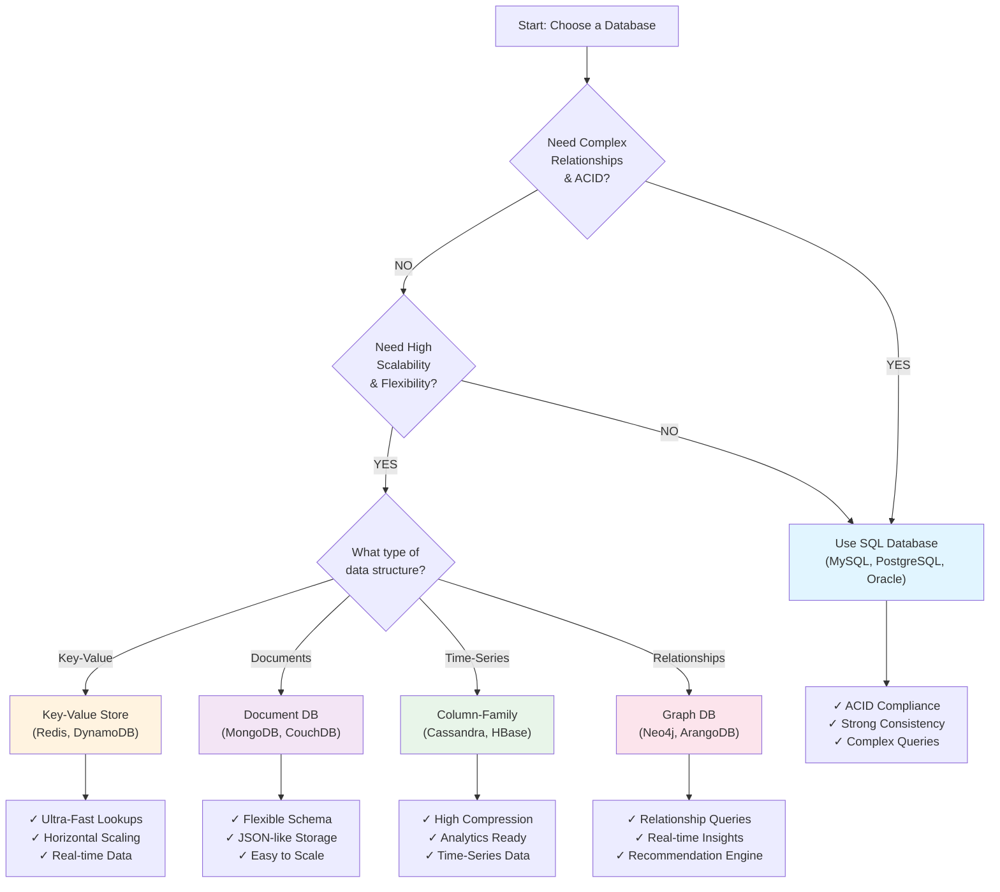

## Back of the Envelope Estimation

What is Back of the envelope estimation?   

Back of the envelope estimation is a rough calculation or approximation of system capacity, performance, and resource requirements. It helps in system design by estimating:
- How many requests per second (RPS) a system needs to handle
- Storage requirements
- Bandwidth needed
- Number of servers required
- Latency and throughput expectations

## Database Selection Diagram

## Quick Comparison Table

| Factor | SQL | NoSQL |
|--------|-----|-------|
| **Scaling** | Vertical | Horizontal |
| **Consistency** | Strong (ACID) | Eventual (BASE) |
| **Data Model** | Relational | Flexible |
| **Query** | SQL | API/Language Specific |
| **Best For** | Financial Systems | High-Volume, Web Apps | 
