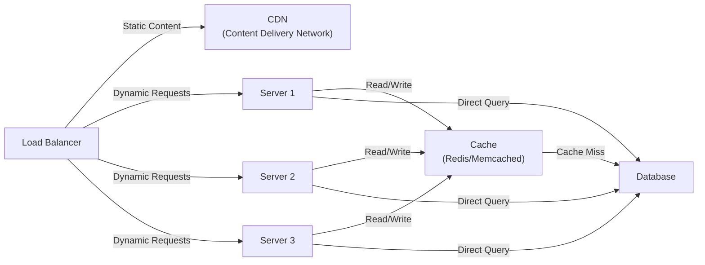

# Back-of-the-Envelope Estimation

What is back-of-the-envelope estimation?

Back-of-the-envelope estimation is a rough calculation or approximation of system capacity, performance, and resource requirements. It helps in system design by estimating:
- How many requests per second (RPS) a system needs to handle
- Storage requirements
- Bandwidth needed
- Number of servers required
- Latency and throughput expectations

## Basic System Architecture with Load Balancing and Caching

## Architecture Overview

### Components

1. **Load Balancer (LB)**
    - Distributes incoming traffic across multiple servers
    - Handles both static and dynamic content routing
    - Ensures even distribution of load
    - Improves system availability and reliability

2. **CDN (Content Delivery Network)**
    - Serves static content (images, CSS, JavaScript, videos)
    - Caches content at edge locations closer to users
    - Reduces bandwidth consumption
    - Improves response time for static assets

3. **Servers (Multiple Instances)**
    - Handle dynamic requests and business logic
    - Horizontally scalable (add more servers as needed)
    - Stateless design for easy scaling
    - Examples: Server 1, Server 2, Server 3...

4. **Cache Layer**
    - Fast in-memory data store (Redis, Memcached)
    - Stores frequently accessed data
    - Reduces database queries
    - Improves application performance

5. **Database**
    - Persistent data storage
    - Single source of truth
    - Handles read/write operations
    - Can be SQL or NoSQL

### Data Flow

1. **Static Content Request**
    - Client → Load Balancer → CDN
    - CDN serves static files from cache or origin

2. **Dynamic Content Request**
    - Client → Load Balancer → Server (1/2/3)
    - Server checks cache for data
    - If cache miss, query database
    - Store result in cache for future requests
    - Return response to client

### Benefits

- **Scalability**: Easy to add more servers as traffic increases
- **Reliability**: If one server fails, traffic is redirected to others
- **Performance**: Cache reduces database load and improves response time
- **Cost Efficiency**: CDN reduces bandwidth costs for static content
- **Availability**: Multiple servers ensure 99.9% uptime

## Design Drivers for System Design

### Considerations

- Use rough, T-shirt-size estimation.
- Do not spend too much time on exact numbers at the beginning.
- Keep assumption values simple and easy to understand, such as 10M, 100M, or 1000M.
- Use rounded numbers to estimate traffic, storage, bandwidth, and server count quickly.

## Quick Estimation Cheat Sheet

Use this table to quickly map zeros to common large-number terms and storage units used in rough estimation.

| Zeros | Value                 | Name        | Common Usage                     | Storage Reference |
|-------|-----------------------|-------------|----------------------------------|-------------------|
| 3     | 1,000                 | Thousand    | Requests, records, small files   | KB = 10^3 bytes   |
| 6     | 1,000,000             | Million     | Users, requests per day, objects | MB = 10^6 bytes   |
| 9     | 1,000,000,000         | Billion     | Large user base, events, rows    | GB = 10^9 bytes   |
| 12    | 1,000,000,000,000     | Trillion    | Very large-scale systems         | TB = 10^12 bytes  |
| 15    | 1,000,000,000,000,000 | Quadrillion | Internet-scale estimation        | PB = 10^15 bytes  |

## Examples

- 1K = 1 thousand
- 1M = 1 million
- 1B = 1 billion
- 1TB = 1 trillion bytes (approx.)

## Data Size Reference for Database Storage Analysis

Use this table for rough estimation when calculating how much space common data types may take in a database.

| Data Type                | Approximate Size | Example Usage                  | Notes                                                                             |
|--------------------------|------------------|--------------------------------|-----------------------------------------------------------------------------------|
| `CHAR(1)` / character    | 1-2 bytes        | Gender, status flag, code      | Depends on encoding such as ASCII or UTF-8/UTF-16.                                |
| `SMALLINT`               | 2 bytes          | Small counters, short codes    | Good for small numeric ranges.                                                    |
| `INTEGER`                | 4 bytes          | User ID, quantity, count       | Common integer type in databases.                                                 |
| `BIGINT` / `LONG`        | 8 bytes          | Large IDs, timestamps          | Used for large numeric values.                                                    |
| `FLOAT`                  | 4 bytes          | Approximate decimal values     | May lose precision.                                                               |
| `DOUBLE`                 | 8 bytes          | Ratings, measurements          | Better precision than float.                                                      |
| `BOOLEAN`                | 1 byte           | Active/inactive, true/false    | Actual storage may vary by database.                                              |
| `DATE`                   | 3-4 bytes        | Birth date, created date       | Depends on database engine.                                                       |
| `DATETIME` / `TIMESTAMP` | 8 bytes          | Created time, updated time     | Common for audit fields.                                                          |
| Short text               | 20-100 bytes     | Name, city, title              | Depends on actual text length.                                                    |
| Long text                | 1 KB+            | Description, comments, article | Often stored as `TEXT` or similar types.                                          |
| Average image            | 300 KB           | Profile photo, product image   | Usually better stored in object storage, with only the URL saved in the database. |

### Quick Storage Estimation Tips

- Add the size of all fields in one row to estimate row size.
- Multiply row size by the number of records to estimate total table size.
- Add extra space for indexes, metadata, and replication.
- For images, videos, and files, prefer object storage and save only the file path or URL in the database.

## Estimating Servers, RAM, Storage, and Bandwidth

After estimating traffic and data size, analyze the following system requirements:

- **Number of servers**: How many application servers are needed to handle peak traffic.
- **RAM**: How much memory is needed for application processing, caching, and database operations.
- **Storage**: How much disk or object storage is required for user data, logs, media, and backups.
- **Bandwidth**: How much network throughput is required for incoming and outgoing traffic.
- **Trade-offs (CAP)**: Decide whether the system should prioritize Consistency, Availability, or Partition Tolerance.

### Traffic and Storage Formula

Use a simple formula for rough storage estimation:

`Total Storage = Number of Users × Average Data per User`

### Storage Calculation Examples

| Scenario           | Formula                                             | Result         |
|--------------------|-----------------------------------------------------|----------------|
| User data storage  | 2 million (6 zero) users x `y` MB (6 zero) per user | `2y` TB        |
| Small profile data | 5 million (6 zero) users x 2 KB (3 zero) per user   | 10 GB (9 zero) |

### Quick Analysis Table

| Resource      | What to Estimate                            | Example Consideration                                              |
|---------------|---------------------------------------------|--------------------------------------------------------------------|
| Servers       | Requests per second, concurrency, CPU load  | 3-10 app servers for moderate traffic                              |
| RAM           | Cache size, active sessions, query workload | 16-64 GB depending on workload                                     |
| Storage       | User data, images, logs, backups            | 10 GB to multiple TB                                               |
| Bandwidth     | Request size x traffic volume               | Depends on API, media, and CDN usage                               |
| CAP Trade-off | Consistency vs availability                 | Banking prefers consistency; social apps often prefer availability |

### Notes

- Always estimate for peak traffic, not only average traffic.
- Add extra capacity for replication, backups, and future growth.
- For images and videos, use object storage instead of storing large files directly in the database.

## Estimation of Facebook

### 1) Traffic Estimation

- **Total users**: 1 billion (1,000,000,000)
- **Daily active users (DAU)**: 25% of total users = 250 million

If each daily active user performs:
- **Read operations**: 5
- **Write operations**: 2
- **Total operations per user per day**: 7

Then:

- **Total daily queries** = 250,000,000 x 7 = 1,750,000,000 queries/day
- **Seconds per day** = 60 x 60 x 24 = 86,400
- **Queries per second (QPS)** = 1,750,000,000 / 86,400 approx. 20,255 QPS

Rounded estimate: **~20K QPS**

### 2) Quick Summary Table

| Metric                 | Value             |
|------------------------|-------------------|
| Total users            | 1 billion         |
| Daily active users     | 250 million (25%) |
| Read ops per user/day  | 5                 |
| Write ops per user/day | 2                 |
| Total ops per user/day | 7                 |
| Total daily queries    | 1.75 billion      |
| Estimated QPS          | ~20K              |

### 3) Storage Estimation

Assumptions:

- Each active user creates **2 posts/day**.
- Each post has **250 characters**.
- Assume **2 bytes per character**.
- **10% of users** upload **1 image/day**.
- Average image size = **300 KB**.

Text storage calculation:

- Per post = 250 characters x 2 bytes = 500 bytes
- Per user per day (2 posts) = 500 x 2 = 1,000 bytes (~1 KB)
- Total text storage/day = 250 million (6 zero) users x 1 KB (3 zero)
- Total text storage/day = 250 million KB = 250 GB (9 zero)

Image storage calculation:

- Users uploading images/day = 10% of 250 million = 25 million users
- Total image storage/day = 25 million x 300 KB
- Total image storage/day = 7,500,000,000 KB = 7.5 TB

Estimated daily storage summary:

| Data Type       | Daily Estimate  |
|-----------------|-----------------|
| Text posts      | 250 GB (9 zero) |
| Images          | 7.5 TB          |
| Total (approx.) | 7.75 TB/day     |

### 4) Five-Year Storage Estimation

To estimate long-term storage, use a rounded time window for easy planning:

- 5 years = 5 x 365 = 1,825 days
- Approximate for rough estimation = **2,000 days**

Calculations:

- Post storage for 5 years = 250 GB/day x 2,000 days = 500,000 GB = 500 TB
- Image storage for 5 years = 7.5 TB/day x 2,000 days = 15,000 TB = 15 PB

| Data Type  | Daily Storage | 5-Year Storage (Approx.) |
|------------|---------------|--------------------------|
| Text posts | 250 GB/day    | 500 TB                   |
| Images     | 7.5 TB/day    | 15 PB                    |
| Total      | 7.75 TB/day   | ~15.5 PB                 |

Notes:

- This is a rough estimate and does not include replication, backups, or compression.
- Real-world systems should add extra capacity for growth, metadata, and indexes.

