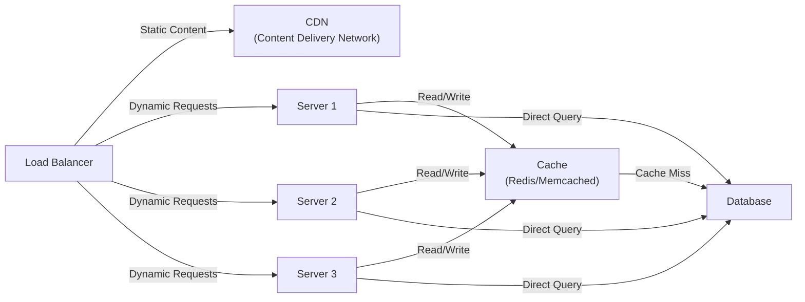

## Back-of-the-Envelope Estimation

What is back-of-the-envelope estimation?

Back-of-the-envelope estimation is a rough calculation or approximation of system capacity, performance, and resource requirements. It helps in system design by estimating:
- How many requests per second (RPS) a system needs to handle
- Storage requirements
- Bandwidth needed
- Number of servers required
- Latency and throughput expectations

## Basic System Architecture with Load Balancing and Caching

## Architecture Overview

### Components

1. **Load Balancer (LB)**
    - Distributes incoming traffic across multiple servers
    - Handles both static and dynamic content routing
    - Ensures even distribution of load
    - Improves system availability and reliability

2. **CDN (Content Delivery Network)**
    - Serves static content (images, CSS, JavaScript, videos)
    - Caches content at edge locations closer to users
    - Reduces bandwidth consumption
    - Improves response time for static assets

3. **Servers (Multiple Instances)**
    - Handle dynamic requests and business logic
    - Horizontally scalable (add more servers as needed)
    - Stateless design for easy scaling
    - Examples: Server 1, Server 2, Server 3...

4. **Cache Layer**
    - Fast in-memory data store (Redis, Memcached)
    - Stores frequently accessed data
    - Reduces database queries
    - Improves application performance

5. **Database**
    - Persistent data storage
    - Single source of truth
    - Handles read/write operations
    - Can be SQL or NoSQL

### Data Flow

1. **Static Content Request**
    - Client → Load Balancer → CDN
    - CDN serves static files from cache or origin

2. **Dynamic Content Request**
    - Client → Load Balancer → Server (1/2/3)
    - Server checks cache for data
    - If cache miss, query database
    - Store result in cache for future requests
    - Return response to client

### Benefits

- **Scalability**: Easy to add more servers as traffic increases
- **Reliability**: If one server fails, traffic is redirected to others
- **Performance**: Cache reduces database load and improves response time
- **Cost Efficiency**: CDN reduces bandwidth costs for static content
- **Availability**: Multiple servers ensure 99.9% uptime

## Design Drivers for System Design

### Considerations

- Use rough, T-shirt-size estimation.
- Do not spend too much time on exact numbers at the beginning.
- Keep assumption values simple and easy to understand, such as 10M, 100M, or 1000M.
- Use rounded numbers to estimate traffic, storage, bandwidth, and server count quickly.

## Quick Estimation Cheat Sheet

Use this table to quickly map zeros to common large-number terms and storage units used in rough estimation.

| Zeros | Value                 | Name        | Common Usage                     | Storage Reference |
|-------|-----------------------|-------------|----------------------------------|-------------------|
| 3     | 1,000                 | Thousand    | Requests, records, small files   | KB = 10^3 bytes   |
| 6     | 1,000,000             | Million     | Users, requests per day, objects | MB = 10^6 bytes   |
| 9     | 1,000,000,000         | Billion     | Large user base, events, rows    | GB = 10^9 bytes   |
| 12    | 1,000,000,000,000     | Trillion    | Very large-scale systems         | TB = 10^12 bytes  |
| 15    | 1,000,000,000,000,000 | Quadrillion | Internet-scale estimation        | PB = 10^15 bytes  |

## Example

- 1K = 1 thousand
- 1M = 1 million
- 1B = 1 billion
- 1TB = 1 trillion bytes (approx.)

