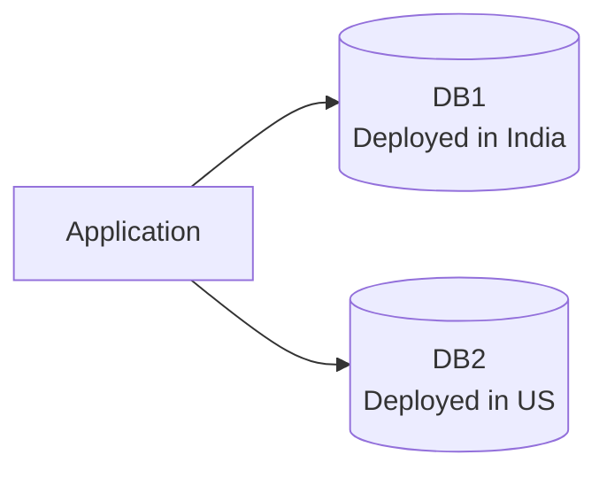

rem# CAP Theorem - Simple Deployment View

## Meaning

- The `Application` is connected to two databases in different regions.
- This kind of layout is often used to discuss CAP tradeoffs during network partition.
- When the India and US sites cannot communicate reliably, the system must choose between consistency and availability.

