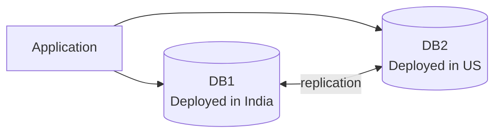

# CAP Theorem

## Core Properties

- **C - Consistency:** Every read receives the most recent write or an error.
- **A - Availability:** Every request receives a non-error response, without guarantee that it contains the most recent write.
- **P - Partition Tolerance:** The system continues to operate despite an arbitrary number of messages being dropped or delayed by the network between nodes.

## Important

**Desirable properties of distributed systems with replicated data.**

## Meaning 

- The `Application` is connected to two databases in different regions.
- `DB1` and `DB2` replicate data between each other.
- This kind of layout is often used to discuss CAP tradeoffs during network partition.
- When the India and US sites cannot communicate reliably, the system must choose between consistency and availability.

