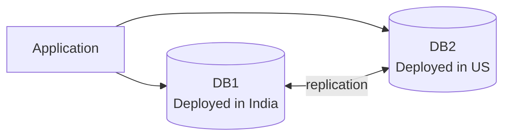

# CAP Theorem

## Core Properties

- **C - Consistency:** Every read receives the most recent write or an error.
- **A - Availability:** Every request receives a non-error response, without guarantee that it contains the most recent write.
- **P - Partition Tolerance:** The system continues to operate despite an arbitrary number of messages being dropped or delayed by the network between nodes.

## Important

**Desirable properties of distributed systems with replicated data.**

## Meaning 

- The `Application` is connected to two databases in different regions.
- `DB1` and `DB2` replicate data between each other.
- This kind of layout is often used to discuss CAP tradeoffs during network partition.
- When the India and US sites cannot communicate reliably, the system must choose between consistency and availability.

## CAP Circle View

<svg width="100%" viewBox="0 0 720 460" xmlns="http://www.w3.org/2000/svg" role="img" aria-label="CAP Theorem Venn diagram">
  <defs>
    
  </defs>

  <rect width="100%" height="100%" fill="#ffffff"/>

  <text x="410" y="44" text-anchor="middle" class="title">CAP Theorem</text>

  <circle cx="305" cy="205" r="150" fill="#60a5fa" fill-opacity="0.42" class="outline"/>
  <circle cx="515" cy="205" r="150" fill="#34d399" fill-opacity="0.42" class="outline"/>
  <circle cx="410" cy="335" r="150" fill="#fbbf24" fill-opacity="0.42" class="outline"/>

  <text x="242" y="160" class="label">C</text>
  <text x="206" y="188" class="sub">Consistency</text>

  <text x="550" y="160" class="label">A</text>
  <text x="516" y="188" class="sub">Availability</text>

  <text x="405" y="405" class="label">P</text>
  <text x="330" y="433" class="sub">Partition Tolerance</text>

  <text x="410" y="208" text-anchor="middle" class="region">C ∩ A</text>
  <text x="346" y="295" text-anchor="middle" class="region">C ∩ P</text>
  <text x="474" y="295" text-anchor="middle" class="region">A ∩ P</text>
  <text x="410" y="255" text-anchor="middle" class="center">C ∩ A ∩ P</text>
  <text x="410" y="278" text-anchor="middle" class="note">Distributed system tradeoff zone</text>
</svg>

The center intersection represents the practical design space where a distributed system must choose how to behave under partition.
