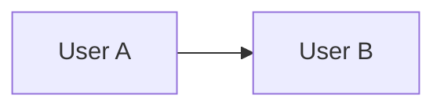
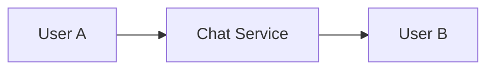
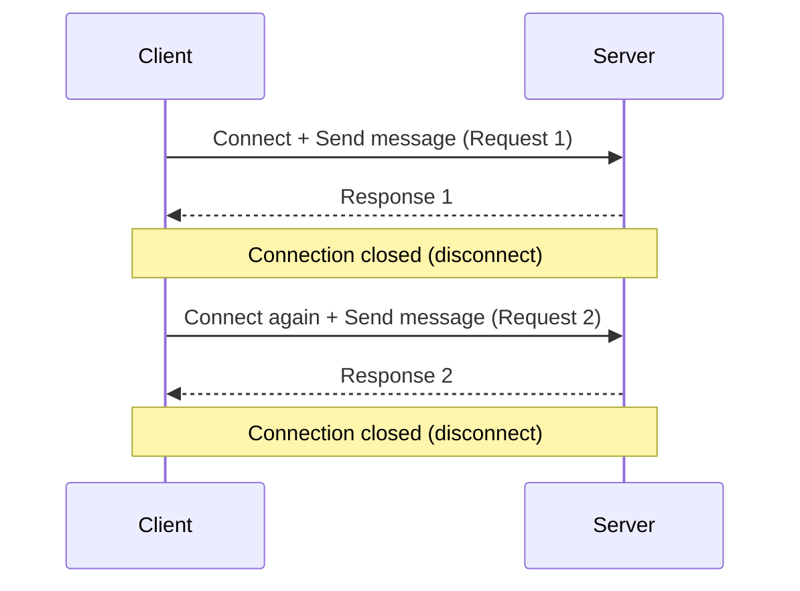
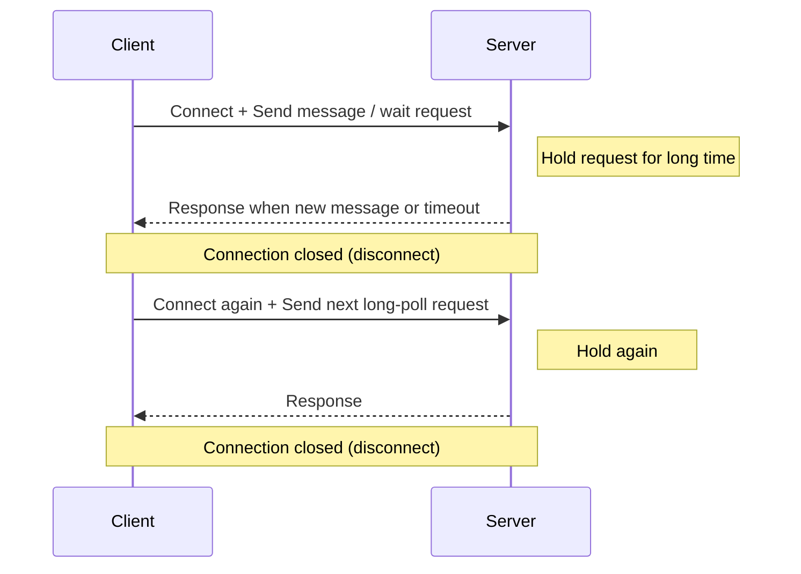

# High-Level Design: Chat Application

This document captures the high-level design approach for a chat application in an interview-friendly format.

---

## 1) Requirement Gathering

### Functional Requirements

- User registration, login, and authentication
- 1:1 chat between users
- Group chat / channels
- Message send, receive, edit, delete
- Message delivery status:
  - sent
  - delivered
  - read
- Typing indicators and online/offline presence
- Message history with pagination and search
- Offline message delivery when a user comes back online
- Push notifications for inactive users
- Media sharing:
  - images
  - videos
  - documents
- Multi-device sync so messages appear on all user devices

### Non-Functional Requirements

- Low latency for message delivery
- High availability and graceful degradation
- Strong durability for stored messages
- Ordering guarantees within a conversation
- Horizontal scalability for users, messages, and fanout
- Secure transport and secure storage of sensitive data
- Support for millions of concurrent connections
- Monitoring, logging, and auditability

### Core Product Decisions

- Real-time chat should use a persistent connection
- Message history should be stored durably
- Offline users should receive missed messages later
- Chat delivery should tolerate retries without duplicate side effects
- Media should be stored outside the main message database

### Communication Cases

#### Case 1: Peer-to-Peer (P2P) 1:1 Chat

- Flow: `User A -> User B`
- Limitation: not suitable for scaling because direct connectivity, NAT traversal, and offline delivery become hard to manage centrally.

#### Case 2: Service-Mediated 1:1 Chat (P2S2P)

- Flow: `User A -> Chat Service -> User B`
- Benefit: suitable for scaling in 1:1 chat due to centralized auth, persistence, retries, and observability.
- Note: group chat still needs additional fanout design (message broker / fanout workers).

---

## 2) Back of Envelope

### Example Assumptions

- Total users: **2 billion**
- Daily active users (DAU): **50 million**
- Per active user:
  - 10 messages to 4 people
  - Total = **40 messages/day/user**
- Message body size assumption: **100 characters ~= 100 bytes**

### Message Volume

- Daily messages = `50M × 40` = **2,000M = 2 billion messages/day**
- Average message rate = `2,000,000,000 / 86,400` ≈ **23,148 messages/sec**

### Storage Estimate

- Per-message payload = **100 bytes**
- Daily payload storage = `2,000,000,000 × 100 bytes` = **200,000,000,000 bytes ~= 200 GB/day**
- 10-year payload storage = `200 GB × 365 × 10` = **730,000 GB ~= 730 TB (~0.73 PB)**
- Practical storage will be higher after metadata, indexes, receipts, media pointers, and replication.

### Connection Estimate

- If 10% of DAU are online simultaneously:
- Concurrent online users = `50M × 10%` = **5 million concurrent connections**
- Peak can be significantly higher during regional traffic spikes

### Bottlenecks to Expect

- Persistent connection management
- Message fanout to many receivers in group chats
- Hot partitions for very large rooms
- Search over message history
- Push notification burst traffic

---

## 3) Core Concept

### Core Components

- **Client Apps**: mobile, web, and desktop clients
- **API Gateway**: authentication, routing, rate limiting
- **Chat Service**: message validation, persistence, delivery orchestration
- **WebSocket Gateway**: maintains live connections for real-time delivery
- **Presence Service**: tracks online/offline/last-seen state
- **Message Store**: durable database for conversations and messages
- **Cache**: recent messages, presence, and session state
- **Message Broker**: async delivery, fanout, retries, and notifications
- **Push Notification Service**: FCM / APNs for offline delivery alerts
- **Media Storage**: object storage + CDN for files

### High-Level Message Flow

1. Sender creates a message in the client.
2. Client sends the message to the server over a persistent connection or HTTPS fallback.
3. Chat service validates the message and stores it durably.
4. Message broker fans out the message to recipients and updates delivery pipelines.
5. Online recipients receive the message instantly through WebSocket.
6. Offline recipients get push notifications and later sync the missed messages.

### Data Model Ideas

- **User**: user profile and device tokens
- **Conversation**: 1:1 or group chat metadata
- **ConversationMember**: user membership and role
- **Message**: sender, conversation id, content, timestamp, status
- **Receipt**: delivered/read acknowledgements
- **Attachment**: media metadata and storage URL

### Important Design Choices

- **Fanout on write** for fast reads in small-to-medium groups
- **Fanout on read** for very large groups to avoid write amplification
- **Partition by conversation id** for scalability
- **Idempotency key** for safe retries and duplicate prevention
- **Cursor-based pagination** for message history

---

## 4) Protocols

### 4.1 Polling

Polling uses short-lived request/response cycles. The client connects, sends/gets data, disconnects, then reconnects after an interval.

#### Flow

- Client connects to server and sends message request.
- Server responds quickly, then connection closes.
- Client reconnects again and sends next message request.

### 4.2 Long Polling (Pushing)

Long polling keeps a request open for longer time. The server responds when new data is available or timeout occurs, then client reconnects.

#### Flow

- Client connects and sends message/receive request.
- Server holds connection and waits for new event for a longer duration.
- Server responds (message/timeout), connection closes.
- Client reconnects and sends next long-poll request.

### Client-to-Server Protocols

- **HTTPS / REST**
  - login, signup, user profile, conversation list, message history, media upload metadata
- **WebSocket**
  - real-time message delivery
  - typing indicators
  - presence updates
  - read receipts

### Server-to-Server Protocols

- **gRPC**
  - fast internal service communication
  - chat service to presence service
  - chat service to notification service
- **Kafka / RabbitMQ / internal event bus**
  - message fanout
  - async delivery processing
  - retries and dead-letter handling

### Notification and Media Protocols

- **FCM / APNs**
  - push notifications to mobile devices
- **HTTPS upload to object storage**
  - media upload and download
- **CDN over HTTPS**
  - fast media delivery across regions

### Recommended Protocol Split

- Use **HTTPS** for request/response operations
- Use **WebSocket** for persistent real-time chat
- Use **gRPC** for internal low-latency service calls
- Use **event streaming** for asynchronous fanout and notification workflows

---

## Summary

For a chat application, the key design goals are real-time delivery, durable message storage, multi-device sync, and scalable fanout. The best protocol mix is usually HTTPS for standard API calls, WebSocket for live messaging, and gRPC or an event bus for internal service communication.
