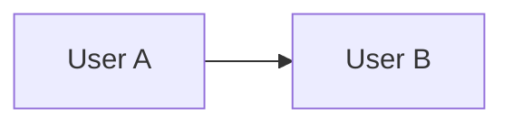
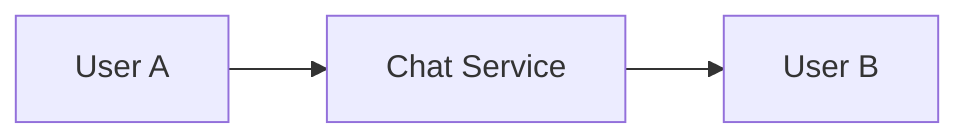
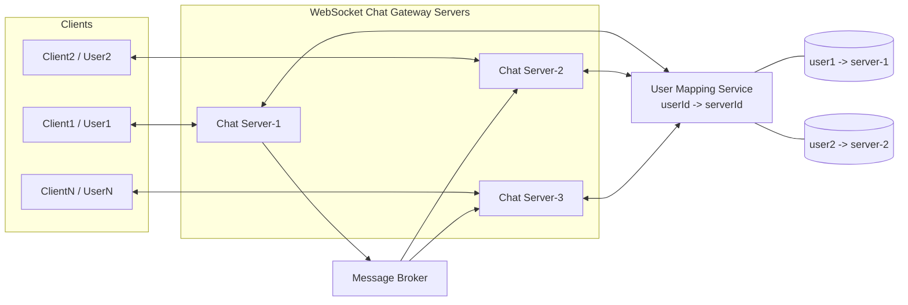
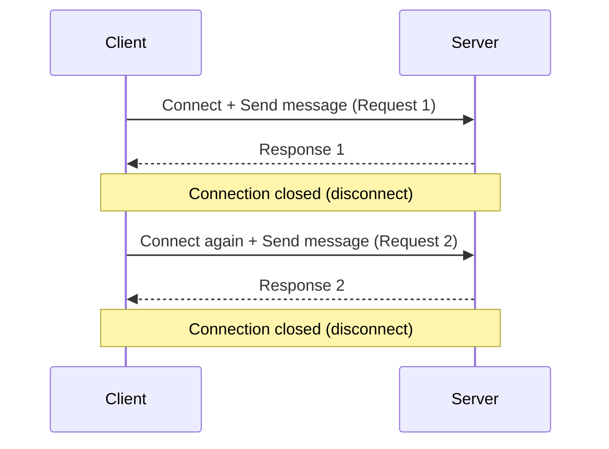
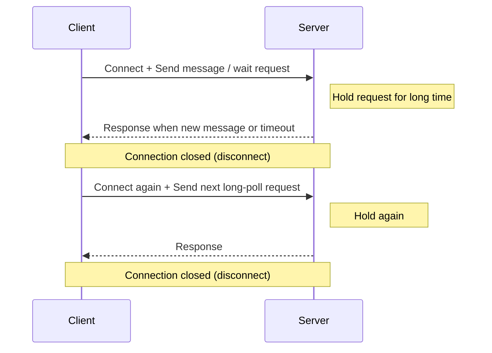
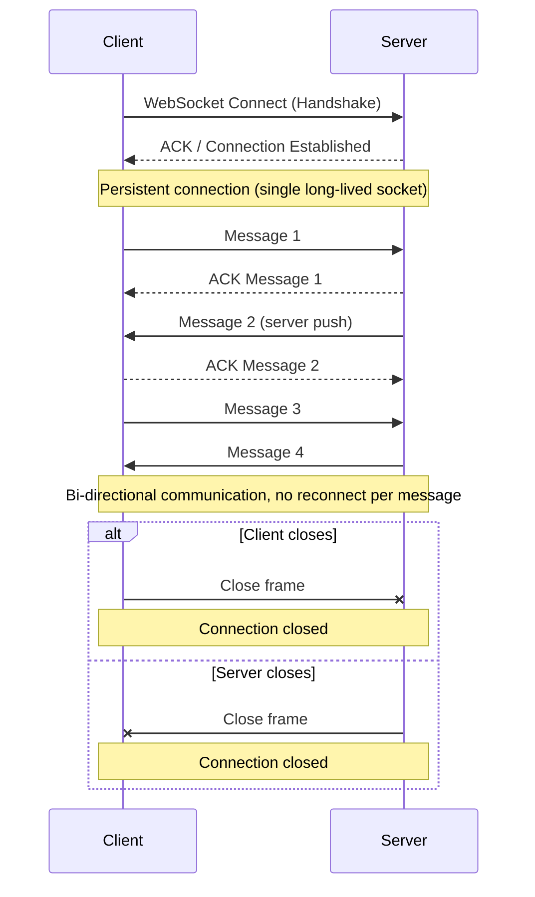

# High-Level Design: Chat Application

This document captures the high-level design approach for a chat application in an interview-friendly format.

---

## 1) Requirement Gathering

### Functional Requirements

- User registration, login, and authentication
- 1:1 chat between users
- Group chat / channels
- Message send, receive, edit, delete
- Message delivery status:
  - sent
  - delivered
  - read
- Typing indicators and online/offline presence
- Message history with pagination and search
- Offline message delivery when a user comes back online
- Push notifications for inactive users
- Media sharing:
  - images
  - videos
  - documents
- Multi-device sync so messages appear on all user devices

### Non-Functional Requirements

- Low latency for message delivery
- High availability and graceful degradation
- Strong durability for stored messages
- Ordering guarantees within a conversation
- Horizontal scalability for users, messages, and fanout
- Secure transport and secure storage of sensitive data
- Support for millions of concurrent connections
- Monitoring, logging, and auditability

### Core Product Decisions

- Real-time chat should use a persistent connection
- Message history should be stored durably
- Offline users should receive missed messages later
- Chat delivery should tolerate retries without duplicate side effects
- Media should be stored outside the main message database

### Communication Cases

#### Case 1: Peer-to-Peer (P2P) 1:1 Chat

- Flow: `User A -> User B`
- Limitation: not suitable for scaling because direct connectivity, NAT traversal, and offline delivery become hard to manage centrally.



#### Case 2: Service-Mediated 1:1 Chat (P2S2P)

- Flow: `User A -> Chat Service -> User B`
- Benefit: suitable for scaling in 1:1 chat due to centralized auth, persistence, retries, and observability.
- Note: group chat still needs additional fanout design (message broker / fanout workers).



---

## 2) Back of Envelope

### Example Assumptions

- Total users: **2 billion**
- Daily active users (DAU): **50 million**
- Per active user:
  - 10 messages to 4 people
  - Total = **40 messages/day/user**
- Message body size assumption: **100 characters ~= 100 bytes**

### Message Volume

- Daily messages = `50M × 40` = **2,000M = 2 billion messages/day**
- Average message rate = `2,000,000,000 / 86,400` ~= **23,148 messages/sec**

### Storage Estimate

- Per-message payload = **100 bytes**
- Daily payload storage = `2,000,000,000 × 100 bytes` = **200,000,000,000 bytes ~= 200 GB/day**
- 10-year payload storage = `200 GB × 365 × 10` = **730,000 GB ~= 730 TB (~0.73 PB)**
- Practical storage will be higher after metadata, indexes, receipts, media pointers, and replication

### Connection Estimate

- If 10% of DAU are online simultaneously:
  - Concurrent online users = `50M × 10%` = **5 million concurrent connections**
- Peak can be significantly higher during regional traffic spikes

### Bottlenecks to Expect

- Persistent connection management
- Message fanout to many receivers in group chats
- Hot partitions for very large rooms
- Search over message history
- Push notification burst traffic

---

## 3) Core Concept

### Core Components

- **Client Apps**: mobile, web, and desktop clients
- **API Gateway**: authentication, routing, rate limiting
- **Chat Service**: message validation, persistence, delivery orchestration
- **WebSocket Gateway**: maintains live connections for real-time delivery
- **Presence Service**: tracks online/offline/last-seen state
- **Message Store**: durable database for conversations and messages
- **Cache**: recent messages, presence, and session state
- **Message Broker**: async delivery, fanout, retries, and notifications
- **Push Notification Service**: FCM / APNs for offline delivery alerts
- **Media Storage**: object storage + CDN for files

### High-Level Message Flow

1. Sender creates a message in the client.
2. Client sends the message to the server over a persistent connection or HTTPS fallback.
3. Chat service validates the message and stores it durably.
4. Message broker fans out the message to recipients and updates delivery pipelines.
5. Online recipients receive the message instantly through WebSocket.
6. Offline recipients get push notifications and later sync the missed messages.

### 1:1 Message Sending Flow (Multi-Server)

In a scaled chat system, `Client1..ClientN` are connected to multiple chat gateway servers. A dedicated `User Mapping Service` keeps the active mapping of each user to the server currently handling that user connection.



#### Routing Steps (User1 sends message to User2)

1. `User1` is connected to `Chat Server-1` and sends a 1:1 message.
2. `Chat Server-1` persists the message and queries `User Mapping Service` for `User2` location.
3. `User Mapping Service` returns: `user2 -> server-2`.
4. `Chat Server-1` forwards the message to `Chat Server-2` (directly or via message broker).
5. `Chat Server-2` pushes the message to `User2` over existing WebSocket connection.
6. Delivery/read ACK follows the reverse path and updates message status.

#### User Mapping Service Responsibilities

- Maintain `userId -> serverId` mapping for currently connected users
- Use **Zookeeper** as a coordination store to keep/update user-to-server connection records across chat servers
- Update mapping on connect, reconnect, heartbeat timeout, and disconnect
- Provide fast lookup for message routing
- Optionally store additional metadata: device id, last seen, and connection timestamp

### Data Model Ideas

- **User**: user profile and device tokens
- **Conversation**: 1:1 or group chat metadata
- **ConversationMember**: user membership and role
- **Message**: sender, conversation id, content, timestamp, status
- **Receipt**: delivered/read acknowledgements
- **Attachment**: media metadata and storage URL

### Message Body

Required fields for chat message payload:

- `from`: sender user id
- `to`: receiver user id (or conversation id for group chat)
- `msg`: message content
- `type`: message type (for example: `text`, `image`, `video`, `file`)

Example payload:

```json
{
  "from": "user_1001",
  "to": "user_2002",
  "msg": "Hi, are you available for a call?",
  "type": "text"
}
```

### Important Design Choices

- **Fanout on write** for fast reads in small-to-medium groups
- **Fanout on read** for very large groups to avoid write amplification
- **Partition by conversation id** for scalability
- **Idempotency key** for safe retries and duplicate prevention
- **Cursor-based pagination** for message history

### DB Decision

#### What data we need to read frequently

- `User1 <-> User2` recent messages
- 1:1 chat history
- Group chat history
- User profile
- Message search

#### Recommended DB Choice

Use a **polyglot persistence** approach instead of forcing everything into one database.

1. **Primary message store: wide-column NoSQL DB**
   - Good choices: **Cassandra**, **ScyllaDB**, **DynamoDB**
   - Best for:
     - 1:1 chat history
     - group chat history
     - high write throughput
     - low-latency reads by conversation

2. **User profile store: relational DB or document DB**
   - Good choices: **PostgreSQL**, **MySQL**, or **MongoDB**
   - Best for:
     - user profile
     - account settings
     - device metadata
     - admin/reporting use cases

3. **Search store: search engine**
   - Good choices: **Elasticsearch** or **OpenSearch**
   - Best for:
     - keyword search in chat history
     - filtering by sender, time range, type
     - full-text search

4. **Cache layer**
   - Good choice: **Redis**
   - Best for:
     - recent conversations
     - presence/session data
     - hot user profile data

#### Why NoSQL is a strong fit for messages

Chat messages are usually accessed by:

- `conversationId`
- time order
- recent message pagination

Typical query pattern is simple:

- get recent 50 messages for a conversation
- get next page before a timestamp/message id
- append a new message

This is an excellent fit for partitioned NoSQL tables such as:

- partition key: `conversationId`
- clustering key: `timestamp` or `messageId`

#### Is there any complex join query?

Usually, **no complex joins are needed on the hot message path**.

For chat systems, we intentionally avoid expensive joins such as:

- joining messages with user profile on every read
- joining group membership, receipts, and attachments in a single runtime query

Instead, common design choices are:

- denormalize small display data where needed
- fetch profile separately from profile store/cache
- precompute conversation/member metadata
- use async pipelines for analytics and reporting

#### Low latency requirement

For low latency, the best practical design is:

- **NoSQL message store** for message history
- **Redis cache** for recent messages and active sessions
- **WebSocket gateway** for real-time delivery
- data partitioned by `conversationId`
- read path optimized for sequential pagination

This avoids heavy joins and keeps message reads fast.

#### Search capability

Search is usually **not served directly from the primary message DB** at scale.

Recommended approach:

1. Write message to primary message store
2. Publish event to broker
3. Index searchable fields into **Elasticsearch/OpenSearch**
4. Run search queries from search engine

This gives:

- full-text search
- filtering by sender or group
- time-range search
- better relevance and ranking support

#### Final Recommendation

- **Messages / chat history** -> **Cassandra / ScyllaDB / DynamoDB**
- **User profile** -> **PostgreSQL / MySQL / MongoDB**
- **Search** -> **Elasticsearch / OpenSearch**
- **Cache** -> **Redis**

If interviewer asks for a single strongest answer, a good practical answer is:

> Use a NoSQL database like Cassandra for chat messages because reads are mostly by conversation and time range, avoid complex joins on the hot path, keep user profile in a separate store, and use Elasticsearch for search.

---

## 4) Protocols

### 4.1 Polling

Polling uses short-lived request/response cycles. The client connects, sends/gets data, disconnects, then reconnects after an interval.

#### Flow

- Client connects to server and sends message request
- Server responds quickly, then connection closes
- Client reconnects again and sends next message request



### 4.2 Long Polling (Pushing)

Long polling keeps a request open for longer time. The server responds when new data is available or timeout occurs, then client reconnects.

#### Flow

- Client connects and sends message/receive request
- Server holds connection and waits for new event for a longer duration
- Server responds (message/timeout), connection closes
- Client reconnects and sends next long-poll request



### 4.3 WebSocket Protocol

WebSocket keeps a persistent connection between client and server. After handshake and ACK, both sides can send messages anytime (bi-directional) without reconnecting for each message.

#### Flow

- Client connects to server using WebSocket handshake
- Server sends ACK and connection is established
- Bi-directional messaging happens on the same persistent connection
- No reconnect is needed for each message while connection is healthy
- If either entity closes the connection, the session is closed



### 4.4 Trade-offs: Polling vs Long Polling vs WebSocket

#### Polling Trade-offs

**Pros**

- Simple to implement and debug
- Works with standard HTTP infrastructure
- Easy retry behavior with short request lifecycle

**Cons**

- Higher request overhead due to frequent reconnects
- Wastes bandwidth when there is no new data
- Higher end-to-end latency (message waits until next poll cycle)
- Increases server and load balancer request count

#### Long Polling Trade-offs

**Pros**

- Lower latency than basic polling for near real-time updates
- Better bandwidth usage than frequent short polling
- Still HTTP-compatible (no full WebSocket requirement)

**Cons**

- More complex timeout/reconnect handling
- Long-held requests increase server connection pressure
- Can be expensive at very high concurrency
- Proxies/timeouts can break long-lived requests unexpectedly

#### WebSocket Trade-offs

**Pros**

- Very low latency bi-directional communication
- Efficient for frequent real-time updates (no per-message reconnect)
- Lower protocol overhead after connection establishment
- Ideal for chat, typing indicators, and presence updates

**Cons**

- Requires stateful connection management at scale
- More complex infrastructure (connection gateways, heartbeats, reconnect strategy)
- Harder load balancing and sticky-session considerations
- Some enterprise proxies/firewalls may block or limit WebSocket behavior

#### Quick Comparison

| Aspect                    | Polling                              | Long Polling                               | WebSocket                                   |
|---------------------------|--------------------------------------|--------------------------------------------|---------------------------------------------|
| Latency                   | Medium to high (poll interval based) | Lower (server responds when event arrives) | Low (near real-time bi-directional)         |
| Bandwidth efficiency      | Lower                                | Better                                     | Best for continuous real-time traffic       |
| Server load pattern       | Many short requests                  | Fewer but longer-lived requests            | Fewer requests, many persistent connections |
| Implementation complexity | Low                                  | Medium                                     | Medium to high                              |
| Best fit                  | Low-scale / less real-time features  | Near real-time on HTTP without WebSocket   | High-scale real-time chat and live updates  |

### Client-to-Server Protocols

- **HTTPS / REST**
  - login, signup, user profile, conversation list, message history, media upload metadata
- **WebSocket**
  - real-time message delivery
  - typing indicators
  - presence updates
  - read receipts

### Server-to-Server Protocols

- **gRPC**
  - fast internal service communication
  - chat service to presence service
  - chat service to notification service
- **Kafka / RabbitMQ / internal event bus**
  - message fanout
  - async delivery processing
  - retries and dead-letter handling

### Recommended Protocol Split

- Use **HTTPS** for request/response operations
- Use **WebSocket** for persistent real-time chat
- Use **gRPC** for internal low-latency service calls
- Use **event streaming** for asynchronous fanout and notification workflows

---


## Summary

For a chat application, the key design goals are real-time delivery, durable message storage, multi-device sync, and scalable fanout. The best protocol mix is usually HTTPS for standard API calls, WebSocket for live messaging, and gRPC or an event bus for internal service communication.
