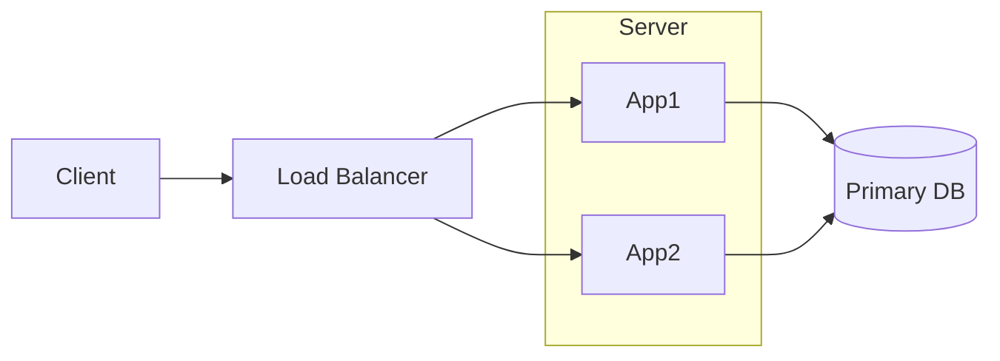
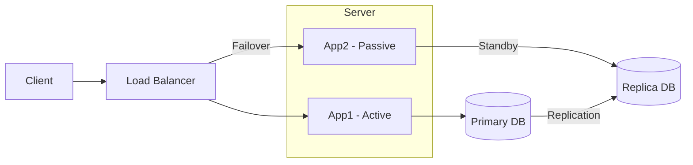
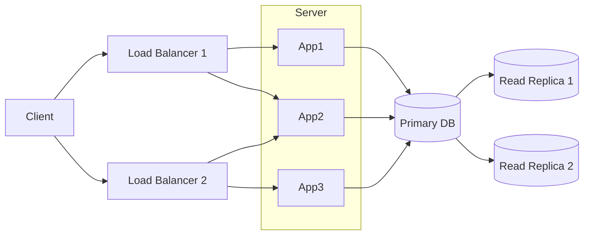

# Design High Availability Architecture

High availability refers to a system design that ensures minimal downtime and maximum uptime, typically aiming for 99.9% to 99.999% availability.

## Alternative Ways to Frame High Availability

The following phrases all describe similar high-availability design goals:

- **Design Data Resilience Architecture**: Build systems that can recover from failures without data loss.
- **Design Architecture to achieve 99.999% Availability**: Create redundancy and failover mechanisms to minimize downtime.
- **Design to avoid Single Points of Failure (SPOF)**: Ensure no single component can bring down the entire system.
- **Active-Passive vs Active-Active Architecture**: Choose between failover and concurrent processing models.

## Availability Levels

The term **"nines"** refers to the number of 9s in the availability percentage. For example:
- 99% = Two 9s
- 99.9% = Three 9s
- 99.99% = Four 9s
- 99.999% = Five 9s

| Availability %    | Downtime per Year | Downtime per Month | Use Case                             |
|-------------------|-------------------|--------------------|--------------------------------------|
| 95% (One 9)       | 18.25 days        | ~1.8 days          | Best-effort services, non-critical   |
| 99% (Two 9s)      | 3.65 days         | ~7 hours           | Basic service tolerance              |
| 99.9% (Three 9s)  | 8.76 hours        | ~43 minutes        | Standard business applications       |
| 99.99% (Four 9s)  | 52.6 minutes      | ~4.3 minutes       | Financial systems, payment platforms |
| 99.999% (Five 9s) | 5.26 minutes      | ~26 seconds        | Critical infrastructure, telecom     |

## Key High Availability Strategies

### 1. Redundancy
- Multiple servers, databases, load balancers
- No single point of failure
- Geographic distribution

### 2. Active-Passive Architecture
- Primary node handles all traffic
- Secondary node on standby for failover
- Faster recovery but underutilizes resources

### 3. Active-Active Architecture
- Multiple nodes handle traffic simultaneously
- Better resource utilization
- More complex coordination (CAP trade-offs)

### 4. Health Monitoring and Failover
- Continuous health checks on all components
- Automated failover when failures detected
- Heartbeat mechanisms

### 5. Data Replication
- Synchronous replication for consistency
- Asynchronous replication for performance
- Multi-region backup

## Single Point of Failure (SPOF) Examples

| Component     | SPOF Risk           | Mitigation                                  |
|---------------|---------------------|---------------------------------------------|
| Load balancer | One LB fails        | Multiple LBs in active-active               |
| Database      | Primary DB down     | Replicated secondaries + automatic failover |
| Cache layer   | Redis instance down | Clustered cache with replication            |
| DNS           | DNS server outage   | Multiple DNS providers                      |

## High Availability Design Diagrams

### 1) Single-Node Style (Has SPOF)

If the primary database fails, the system becomes unavailable.

**Advantages**: Simple architecture, easy to implement.

**Disadvantages**: Single point of failure, downtime during maintenance.

### 2) Two-Node Active-Passive

If the active node fails, traffic shifts to the passive node.

**Advantages**: Better availability than single-node setup, controlled failover.

**Disadvantages**: Passive resources are underutilized.

### 3) Multi-Node Active-Active

All active nodes serve traffic simultaneously; failure of one node does not stop service.

**Advantages**: High availability, better resource utilization, horizontal scalability.

**Disadvantages**: More operational complexity and coordination overhead.

