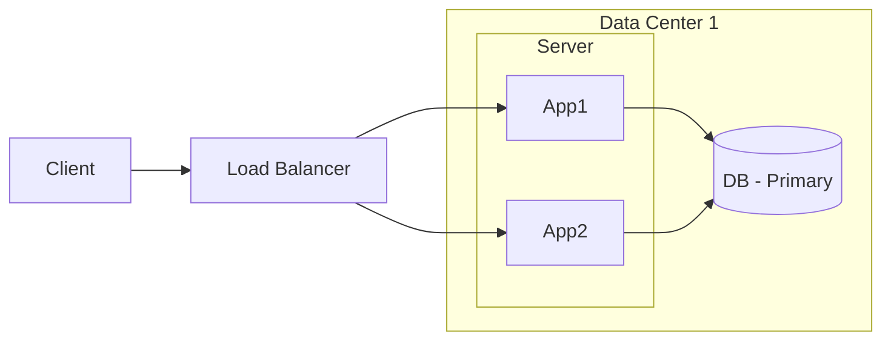
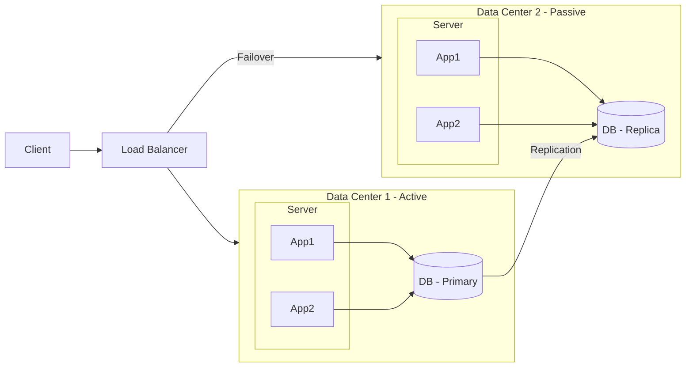
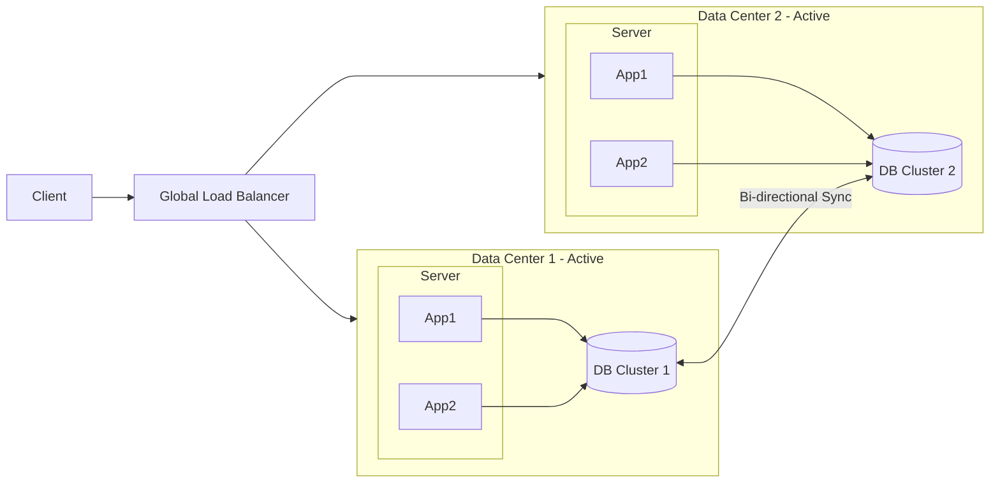

# Design High Availability Architecture

High availability refers to a system design that ensures minimal downtime and maximum uptime, typically aiming for 99.9% to 99.999% availability.

## Alternative Ways to Frame High Availability

The following phrases all describe similar high-availability design goals:

- **Design Data Resilience Architecture**: Build systems that can recover from failures without data loss.
- **Design Architecture to achieve 99.999% Availability**: Create redundancy and failover mechanisms to minimize downtime.
- **Design to avoid Single Points of Failure (SPOF)**: Ensure no single component can bring down the entire system.
- **Active-Passive vs Active-Active Architecture**: Choose between failover and concurrent processing models.

## Availability Levels

The term **"nines"** refers to the number of 9s in the availability percentage. For example:
- 99% = Two 9s
- 99.9% = Three 9s
- 99.99% = Four 9s
- 99.999% = Five 9s

| Availability %    | Downtime per Year | Downtime per Month | Use Case                             |
|-------------------|-------------------|--------------------|--------------------------------------|
| 95% (One 9)       | 18.25 days        | ~1.8 days          | Best-effort services, non-critical   |
| 99% (Two 9s)      | 3.65 days         | ~7 hours           | Basic service tolerance              |
| 99.9% (Three 9s)  | 8.76 hours        | ~43 minutes        | Standard business applications       |
| 99.99% (Four 9s)  | 52.6 minutes      | ~4.3 minutes       | Financial systems, payment platforms |
| 99.999% (Five 9s) | 5.26 minutes      | ~26 seconds        | Critical infrastructure, telecom     |

## Key High Availability Strategies

### 1. Redundancy
- Multiple servers, databases, load balancers
- No single point of failure
- Geographic distribution

### 2. Active-Passive Architecture
- Primary node handles all traffic
- Secondary node on standby for failover
- Faster recovery but underutilizes resources

### 3. Active-Active Architecture
- Multiple nodes handle traffic simultaneously
- Better resource utilization
- More complex coordination (CAP trade-offs)

### 4. Health Monitoring and Failover
- Continuous health checks on all components
- Automated failover when failures detected
- Heartbeat mechanisms

### 5. Data Replication
- Synchronous replication for consistency
- Asynchronous replication for performance
- Multi-region backup

## Single Point of Failure (SPOF) Examples

| Component     | SPOF Risk           | Mitigation                                  |
|---------------|---------------------|---------------------------------------------|
| Load balancer | One LB fails        | Multiple LBs in active-active               |
| Database      | Primary DB down     | Replicated secondaries + automatic failover |
| Cache layer   | Redis instance down | Clustered cache with replication            |
| DNS           | DNS server outage   | Multiple DNS providers                      |

## High Availability Design Diagrams

### 1) Single-Node Style (Has SPOF)

In this approach, the application and database run in a single data center path. It is easy to build but risky for production.

If the primary database or data center fails, the system becomes unavailable.

**When to use**: Dev/test environments, internal tools, low-critical workloads.

**Advantages**:
- Simple architecture and lower cost.
- Easy deployment and debugging.

**Disadvantages**:
- Single point of failure (SPOF).
- Planned maintenance can cause downtime.
- No disaster recovery path.

### 2) Active-Passive Architecture (Two Data Centers)

Application servers and databases are deployed across two data centers. DC1 handles live traffic; DC2 remains standby for failover.

If the active data center fails, traffic shifts to the passive data center.

**Note**: Oracle, MySQL, and PostgreSQL typically support writes on the primary database and replication to the secondary database, either asynchronously or synchronously.

**When to use**: Business-critical applications that need DR with simpler operations.

**Advantages**:
- Better availability than single-node setup.
- Clear failover path and disaster recovery.
- Easier consistency model than active-active.

**Disadvantages**:
- Passive resources are mostly idle.
- Failover still has recovery time (RTO).
- Cross-DC replication lag may affect RPO.

### 3) Active-Active Architecture (Two Data Centers)

Both data centers are active and serve traffic at the same time. This provides high availability and better utilization.

**Note**: Cassandra can be used for multi-master replication, or other databases that support active-active replication can be used.

If one data center fails, the other keeps serving traffic.

**When to use**: Global products requiring low latency and very high availability.

**Advantages**:
- Highest availability and fault tolerance.
- Better resource utilization (both DCs serve traffic).
- Lower latency by routing users to nearest region.

**Disadvantages**:
- Higher architectural and operational complexity.
- Hard conflict resolution and data consistency handling.
- Higher infrastructure and monitoring costs.

