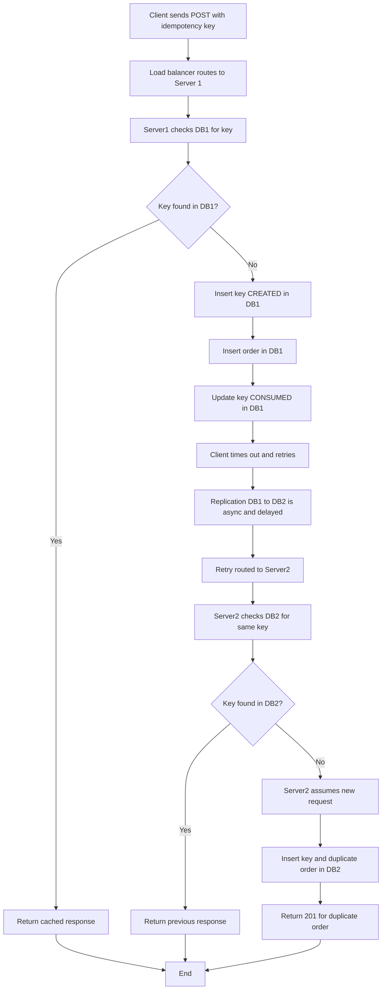

# MultiServerIdempotentIssueFlow (GitHub Renderable)

```mermaid
flowchart TD
    A[Client sends POST with idempotency key] --> B[Load balancer routes to Server 1]
    B --> C[Server1 checks DB1 for key]
    C --> D{Key found in DB1?}
    D -- Yes --> D1[Return cached response] --> Z[End]
    D -- No --> E[Insert key CREATED in DB1]
    E --> F[Insert order in DB1]
    F --> G[Update key CONSUMED in DB1]
    G --> H[Client times out and retries]

    H --> I[Replication DB1 to DB2 is async and delayed]
    I --> J[Retry routed to Server2]
    J --> K[Server2 checks DB2 for same key]
    K --> L{Key found in DB2?}
    L -- Yes --> L1[Return previous response] --> Z
    L -- No --> M[Server2 assumes new request]
    M --> N[Insert key and duplicate order in DB2]
    N --> O[Return 201 for duplicate order]
    O --> Z
```

