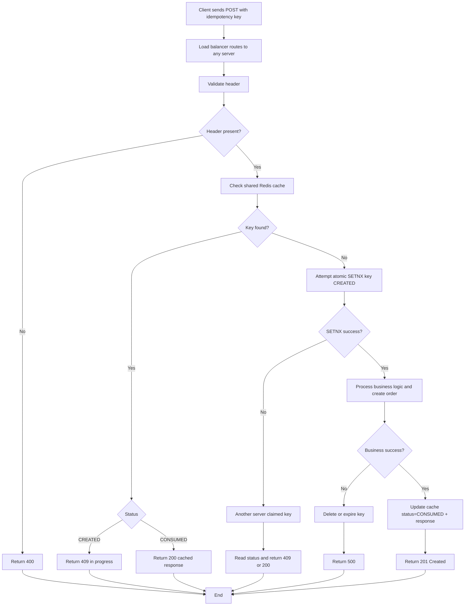

# MultiServerIdempotentWithCacheFlow (GitHub Renderable)

```mermaid
flowchart TD
    A[Client sends POST with idempotency key] --> B[Load balancer routes to any server]
    B --> C[Validate header]
    C --> D{Header present?}
    D -- No --> D1[Return 400] --> Z[End]
    D -- Yes --> E[Check shared Redis cache]

    E --> F{Key found?}
    F -- Yes --> G{Status}
    G -- CREATED --> G1[Return 409 in progress] --> Z
    G -- CONSUMED --> G2[Return 200 cached response] --> Z

    F -- No --> H[Attempt atomic SETNX key CREATED]
    H --> I{SETNX success?}
    I -- No --> J[Another server claimed key]
    J --> K[Read status and return 409 or 200] --> Z

    I -- Yes --> L[Process business logic and create order]
    L --> M{Business success?}
    M -- No --> M1[Delete or expire key] --> M2[Return 500] --> Z
    M -- Yes --> N[Update cache status=CONSUMED + response]
    N --> O[Return 201 Created]
    O --> Z
```

