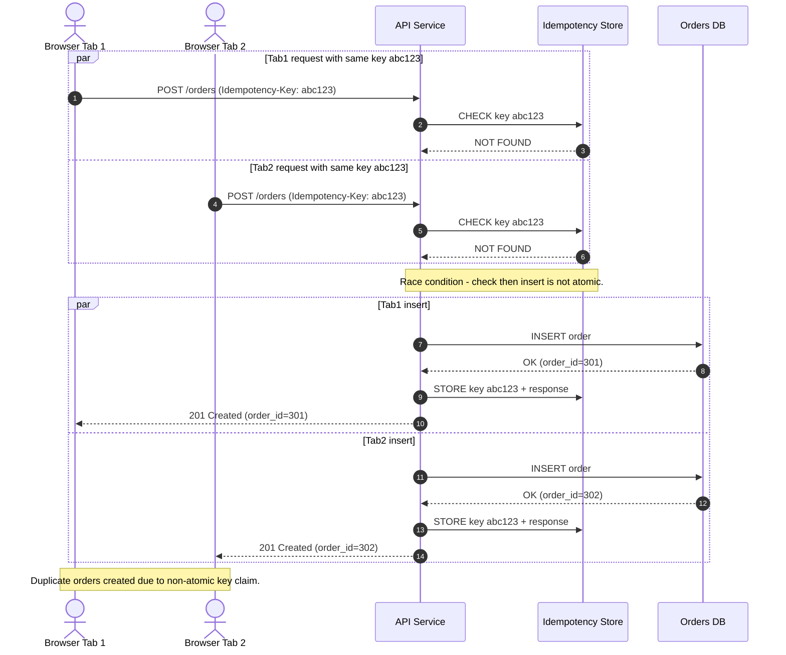

# PostApiIssueParallel (GitHub Renderable)

```mermaid
sequenceDiagram
    autonumber
    actor Tab1 as Browser Tab 1
    actor Tab2 as Browser Tab 2
    participant API as API Service
    participant Store as Idempotency Store
    participant DB as Orders DB

    par Tab1 request with same key abc123
      Tab1->>API: POST /orders (Idempotency-Key: abc123)
      API->>Store: CHECK key abc123
      Store-->>API: NOT FOUND
    and Tab2 request with same key abc123
      Tab2->>API: POST /orders (Idempotency-Key: abc123)
      API->>Store: CHECK key abc123
      Store-->>API: NOT FOUND
    end

    note over API,Store: Race condition - check then insert is not atomic.

    par Tab1 insert
      API->>DB: INSERT order
      DB-->>API: OK (order_id=301)
      API->>Store: STORE key abc123 + response
      API-->>Tab1: 201 Created (order_id=301)
    and Tab2 insert
      API->>DB: INSERT order
      DB-->>API: OK (order_id=302)
      API->>Store: STORE key abc123 + response
      API-->>Tab2: 201 Created (order_id=302)
    end

    note over Tab1,Tab2: Duplicate orders created due to non-atomic key claim.
```

