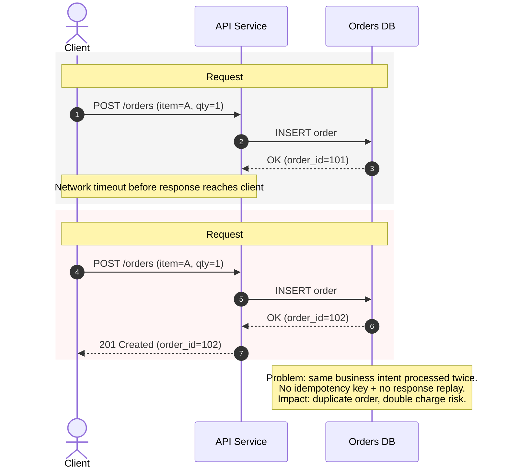

# PostApiIssueSequence

```mermaid
sequenceDiagram
    autonumber
    actor Client
    participant API as API Service
    participant DB as Orders DB

    rect rgb(245,245,245)
    note over Client,DB: Request #1
    Client->>API: POST /orders (item=A, qty=1)
    API->>DB: INSERT order
    DB-->>API: OK (order_id=101)
    note over Client,API: Network timeout before response reaches client
    end

    rect rgb(255,245,245)
    note over Client,DB: Request #2 (retry of same intent)
    Client->>API: POST /orders (item=A, qty=1)
    API->>DB: INSERT order
    DB-->>API: OK (order_id=102)
    API-->>Client: 201 Created (order_id=102)
    end

    note over DB: Problem: same business intent processed twice.<br/>No idempotency key + no response replay.<br/>Impact: duplicate order, double charge risk.
```
