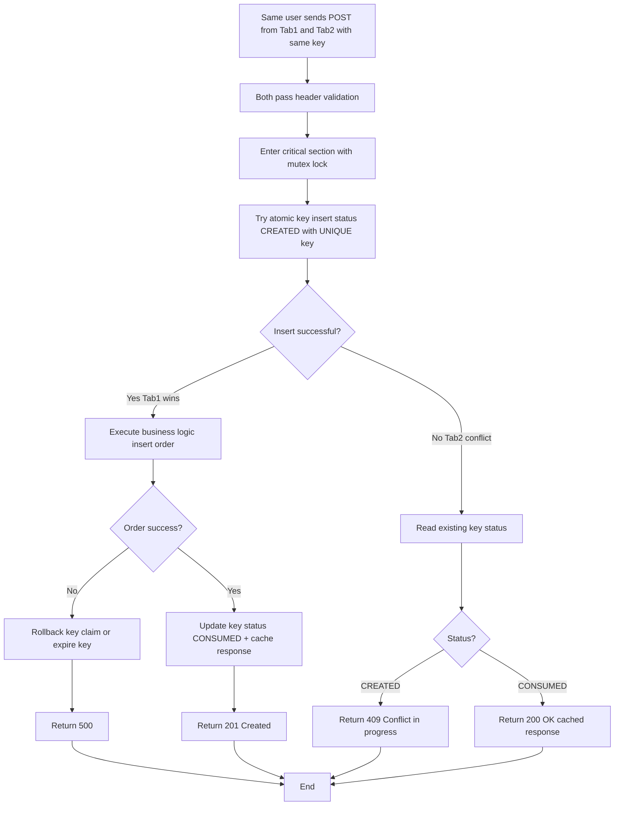

# PostApiSolutionParallelFlow (GitHub Renderable)

```mermaid
flowchart TD
    A[Same user sends POST from Tab1 and Tab2 with same key] --> B[Both pass header validation]
    B --> C[Enter critical section with mutex lock]
    C --> D[Try atomic key insert status CREATED with UNIQUE key]
    D --> E{Insert successful?}

    E -- Yes Tab1 wins --> F[Execute business logic insert order]
    F --> G{Order success?}
    G -- No --> G1[Rollback key claim or expire key] --> G2[Return 500] --> Z[End]
    G -- Yes --> H[Update key status CONSUMED + cache response]
    H --> I[Return 201 Created] --> Z

    E -- No Tab2 conflict --> J[Read existing key status]
    J --> K{Status?}
    K -- CREATED --> K1[Return 409 Conflict in progress] --> Z
    K -- CONSUMED --> K2[Return 200 OK cached response] --> Z
```

