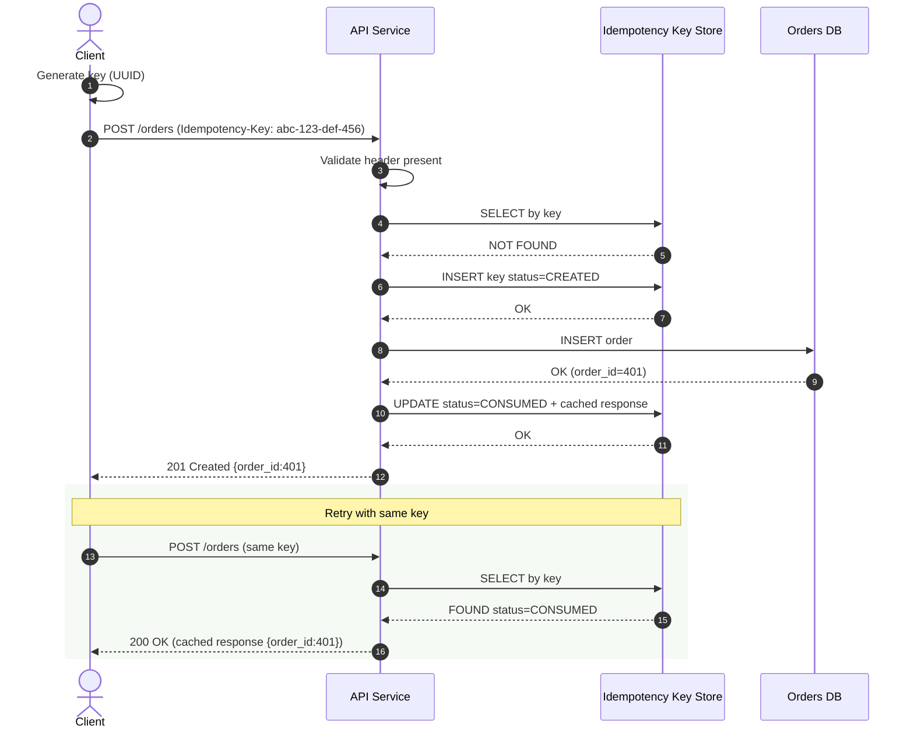

# PostApiSolutionSequence (GitHub Renderable)

```mermaid
sequenceDiagram
    autonumber
    actor Client
    participant API as API Service
    participant KeyStore as Idempotency Key Store
    participant DB as Orders DB

    Client->>Client: Generate key (UUID)
    Client->>API: POST /orders (Idempotency-Key: abc-123-def-456)
    API->>API: Validate header present

    API->>KeyStore: SELECT by key
    KeyStore-->>API: NOT FOUND

    API->>KeyStore: INSERT key status=CREATED
    KeyStore-->>API: OK

    API->>DB: INSERT order
    DB-->>API: OK (order_id=401)

    API->>KeyStore: UPDATE status=CONSUMED + cached response
    KeyStore-->>API: OK
    API-->>Client: 201 Created {order_id:401}

    rect rgb(245,250,245)
    note over Client,KeyStore: Retry with same key
    Client->>API: POST /orders (same key)
    API->>KeyStore: SELECT by key
    KeyStore-->>API: FOUND status=CONSUMED
    API-->>Client: 200 OK (cached response {order_id:401})
    end
```

