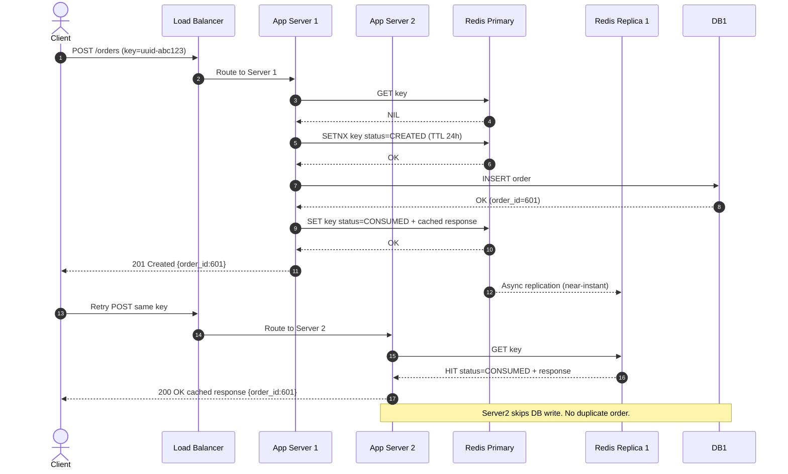

# MultiServerIdempotentWithCache

```mermaid
sequenceDiagram
    autonumber
    actor Client
    participant LB as Load Balancer
    participant S1 as App Server 1
    participant S2 as App Server 2 
    participant Redis as Redis Primary
    participant R1 as Redis Replica 1
    participant DB1 as DB1

    Client->>LB: POST /orders (key=uuid-abc123)
    LB->>S1: Route to Server 1
    S1->>Redis: GET key
    Redis-->>S1: NIL
    S1->>Redis: SETNX key status=CREATED (TTL 24h)
    Redis-->>S1: OK
    S1->>DB1: INSERT order
    DB1-->>S1: OK (order_id=601)
    S1->>Redis: SET key status=CONSUMED + cached response
    Redis-->>S1: OK
    S1-->>Client: 201 Created {order_id:601}

    Redis-->>R1: Async replication (near-instant)

    Client->>LB: Retry POST same key
    LB->>S2: Route to Server 2
    S2->>R1: GET key
    R1-->>S2: HIT status=CONSUMED + response
    S2-->>Client: 200 OK cached response {order_id:601}

    note over S2,DB1: Server2 skips DB write. No duplicate order.
```

