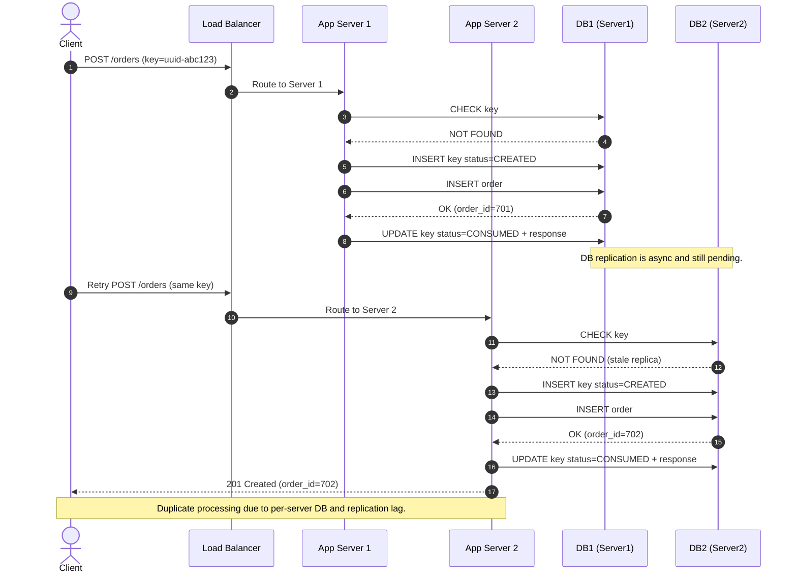

# MultiServerIdempotentIssue

```mermaid
sequenceDiagram
    autonumber
    actor Client
    participant LB as Load Balancer
    participant S1 as App Server 1
    participant S2 as App Server 2
    participant DB1 as DB1 (Server1)
    participant DB2 as DB2 (Server2)

    Client->>LB: POST /orders (key=uuid-abc123)
    LB->>S1: Route to Server 1
    S1->>DB1: CHECK key
    DB1-->>S1: NOT FOUND
    S1->>DB1: INSERT key status=CREATED
    S1->>DB1: INSERT order
    DB1-->>S1: OK (order_id=701)
    S1->>DB1: UPDATE key status=CONSUMED + response

    note over DB1,DB2: DB replication is async and still pending.

    Client->>LB: Retry POST /orders (same key)
    LB->>S2: Route to Server 2
    S2->>DB2: CHECK key
    DB2-->>S2: NOT FOUND (stale replica)
    S2->>DB2: INSERT key status=CREATED
    S2->>DB2: INSERT order
    DB2-->>S2: OK (order_id=702)
    S2->>DB2: UPDATE key status=CONSUMED + response
    S2-->>Client: 201 Created (order_id=702)

    note over Client,S2: Duplicate processing due to per-server DB and replication lag.
```

