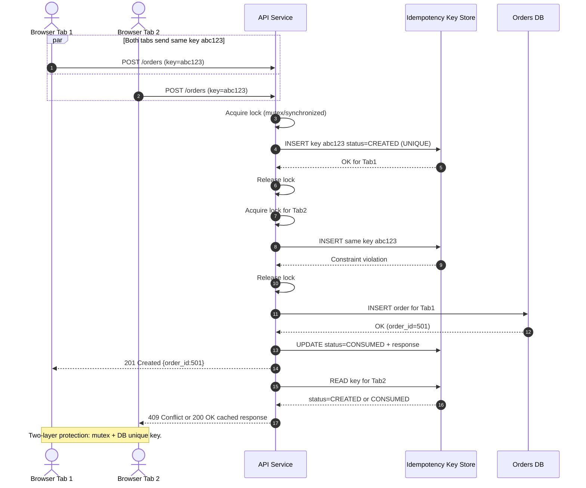

# PostApiSolutionParallel

```mermaid
sequenceDiagram
    autonumber
    actor Tab1 as Browser Tab 1
    actor Tab2 as Browser Tab 2
    participant API as API Service
    participant KeyStore as Idempotency Key Store
    participant DB as Orders DB

    par Both tabs send same key abc123
      Tab1->>API: POST /orders (key=abc123)
    and
      Tab2->>API: POST /orders (key=abc123)
    end

    API->>API: Acquire lock (mutex/synchronized)
    API->>KeyStore: INSERT key abc123 status=CREATED (UNIQUE)
    KeyStore-->>API: OK for Tab1
    API->>API: Release lock

    API->>API: Acquire lock for Tab2
    API->>KeyStore: INSERT same key abc123
    KeyStore-->>API: Constraint violation
    API->>API: Release lock

    API->>DB: INSERT order for Tab1
    DB-->>API: OK (order_id=501)
    API->>KeyStore: UPDATE status=CONSUMED + response
    API-->>Tab1: 201 Created {order_id:501}

    API->>KeyStore: READ key for Tab2
    KeyStore-->>API: status=CREATED or CONSUMED
    API-->>Tab2: 409 Conflict or 200 OK cached response

    note over Tab1,Tab2: Two-layer protection: mutex + DB unique key.
```

