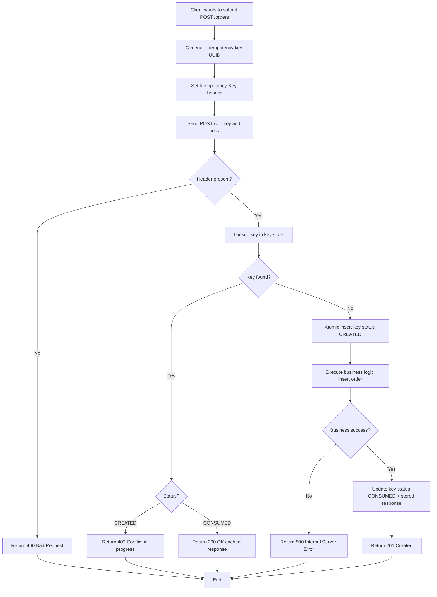

# PostApiSolutionSequenceFlow

```mermaid
flowchart TD
    A[Client wants to submit POST /orders] --> B[Generate idempotency key UUID]
    B --> C[Set Idempotency-Key header]
    C --> D[Send POST with key and body]

    D --> E{Header present?}
    E -- No --> E1[Return 400 Bad Request] --> Z[End]
    E -- Yes --> F[Lookup key in key store]

    F --> G{Key found?}
    G -- Yes --> H{Status?}
    H -- CREATED --> H1[Return 409 Conflict in progress] --> Z
    H -- CONSUMED --> H2[Return 200 OK cached response] --> Z

    G -- No --> I[Atomic insert key status CREATED]
    I --> J[Execute business logic insert order]
    J --> K{Business success?}
    K -- No --> K1[Return 500 Internal Server Error] --> Z
    K -- Yes --> L[Update key status CONSUMED + stored response]
    L --> M[Return 201 Created]
    M --> Z
```

