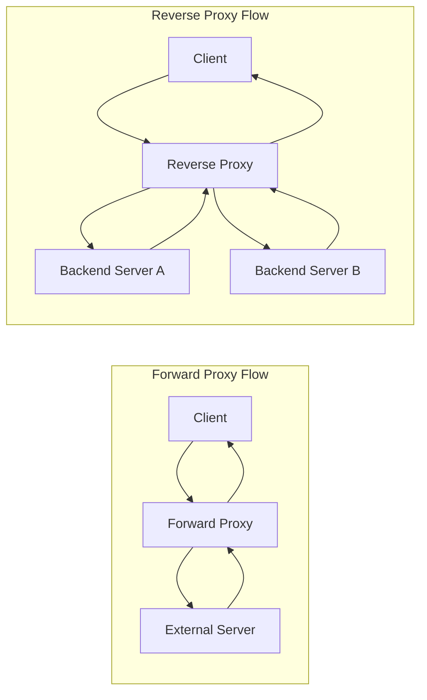

# Proxy vs Reverse Proxy

A **proxy** and a **reverse proxy** both sit between two parties and forward requests, but they solve different problems and are placed at different sides of a system.

## 1) Forward Proxy (Client-Side Proxy)

A **forward proxy** (commonly called just "proxy") sits **in front of clients**.

- Clients send requests to the proxy.
- Proxy sends requests to external servers on behalf of clients.
- Server often sees the proxy as the caller, not the original client.

### Why use it?

- Hide client identity/IP
- Apply organization internet policies (block sites, allowlists)
- Content filtering and compliance
- Caching outbound responses to reduce bandwidth and latency

### Real-world example

A company configures employee laptops to access the internet via `corp-proxy.company.com`.

- Employee requests `https://example.com`.
- Proxy checks policy (allowed/blocked).
- If allowed, proxy forwards to `example.com`.
- Proxy may cache the response and return it faster for repeated requests.

## 2) Reverse Proxy (Server-Side Proxy)

A **reverse proxy** sits **in front of backend servers**.

- Clients send requests to the reverse proxy endpoint.
- Reverse proxy routes requests to one of many internal services.
- Client usually does not know which backend handled the request.

### Why use it?

- Load balancing across multiple app servers
- TLS/SSL termination (HTTPS handled at proxy)
- Centralized auth/rate limiting/WAF rules
- Caching static or dynamic responses
- Blue/green or canary traffic routing
- Hide internal network topology

### Real-world example

An e-commerce site exposes `https://api.shop.com` via Nginx/HAProxy/Envoy.

- Client calls `GET /products/123`.
- Reverse proxy forwards to one healthy instance from `product-service` pool.
- If one instance is down, traffic is routed to others.
- Client still talks only to `api.shop.com`.

## 3) Key Difference at a Glance

| Aspect                 | Forward Proxy                           | Reverse Proxy                                |
|------------------------|-----------------------------------------|----------------------------------------------|
| Sits in front of       | Clients                                 | Servers                                      |
| Used by                | Client organization                     | Service owner/platform team                  |
| Main goal              | Control/protect client outbound traffic | Scale/protect backend services               |
| Visibility to endpoint | Server sees proxy                       | Client sees proxy endpoint                   |
| Typical use cases      | Corporate browsing policies, anonymity  | Load balancing, TLS termination, API gateway |

## 4) Simple Request Flow Diagram

## 5) Quick Memory Trick

- **Forward proxy protects/represents the client side.**
- **Reverse proxy protects/represents the server side.**

## 6) Common Technologies

- Forward proxy: Squid, corporate secure web gateways
- Reverse proxy: Nginx, HAProxy, Envoy, Traefik, cloud load balancers

## 7) What is a Proxy Server?

A **proxy server** is an intermediary that receives a request from one side, optionally applies policies or transformations, and forwards that request to the destination on the other side.

In simple words: it is a "middle layer" between requester and responder.

A proxy can:

- hide one side's identity/IP
- filter or block traffic
- cache responses
- log and audit access
- enforce security rules

## 8) Different Types of Proxy Servers

You can classify proxies in multiple ways. The most practical classification is by **placement** and **purpose**.

### By placement

- **Forward proxy**: sits in front of clients; used for outbound internet access control.
- **Reverse proxy**: sits in front of servers; used for inbound traffic management.

### By behavior/purpose (common in interviews)

- **Transparent proxy**: intercepts traffic without explicit client configuration.
- **Anonymous proxy**: hides client IP but may identify itself as a proxy.
- **Elite (high-anonymity) proxy**: hides client IP and tries to look like a direct client.
- **Caching proxy**: stores responses and serves repeated requests quickly.
- **SSL/TLS proxy**: decrypts/re-encrypts traffic for inspection or termination.

> Note: In system design, forward vs reverse proxy is usually the most important distinction.

## 9) Proxy vs VPN

| Aspect | Proxy | VPN |
|---|---|---|
| Scope | Usually app-level (browser/app specific) | Device/network-level tunnel |
| Encryption | Not guaranteed (depends on proxy type) | Typically encrypted tunnel end-to-end to VPN server |
| IP masking | Yes (through proxy IP) | Yes (through VPN egress IP) |
| Performance | Often faster/lighter | Usually more overhead due to encryption |
| Typical use | Caching, routing, filtering, org policy | Secure traffic over untrusted networks, privacy |

### Quick rule

- Use **proxy** when you need traffic control/routing for specific apps.
- Use **VPN** when you need secure tunneling for most/all network traffic.

## 10) Proxy vs Load Balancer

| Aspect | Proxy (general) | Load Balancer |
|---|---|---|
| Primary goal | Mediate/filter/cache/hide endpoints | Distribute requests across multiple backends |
| Side | Can be forward or reverse | Usually reverse-side |
| Traffic policy | Rich policy options (auth, cache, rewrite) | Focus on balancing algorithms + health checks |
| Can overlap? | Yes | Yes |

A modern reverse proxy (Nginx, Envoy, HAProxy) can also act as a load balancer.

So think of **load balancing** as a capability, while **proxy** is a broader role.

## 11) Proxy vs Firewall

| Aspect | Proxy | Firewall |
|---|---|---|
| Core function | Intermediary for request/response flow | Enforce allow/deny network security rules |
| OSI focus | Often L7 (HTTP/HTTPS), sometimes L4 | Commonly L3/L4; next-gen can inspect L7 |
| Typical action | Forward, cache, rewrite, terminate TLS | Permit, block, inspect, segment traffic |
| Placement | In traffic path as mediator | At network boundaries/segments |

They are complementary, not alternatives:

- Firewall controls **who can talk to whom**.
- Proxy controls **how the allowed traffic is handled**.

## 12) CDN vs Forward Proxy vs Reverse Proxy

| Aspect | CDN | Forward Proxy | Reverse Proxy |
|---|---|---|---|
| Owned by | Content/service provider | Client org/user | Service owner |
| Sits near | End users (edge POPs) | Clients | Origin servers |
| Main goal | Global low-latency content delivery | Client outbound control/privacy | Protect/scale backend |
| Caching | Heavy edge caching | Optional local/org caching | Optional near-origin caching |
| Typical traffic direction | Inbound to public content/API | Outbound from clients | Inbound to service |

### Relationship in real architecture

- A **CDN often includes reverse-proxy behavior** at edge locations.
- A **forward proxy** is usually unrelated to public content delivery and is mostly client-side enterprise control.

### Practical example

For `www.news.com`:

- End user may go through a corporate **forward proxy**.
- Request then hits CDN edge (which behaves like a distributed **reverse proxy/cache**).
- Cache miss goes to origin behind an internal **reverse proxy/load balancer**.

That means all three can exist in a single request path, each solving a different problem.
