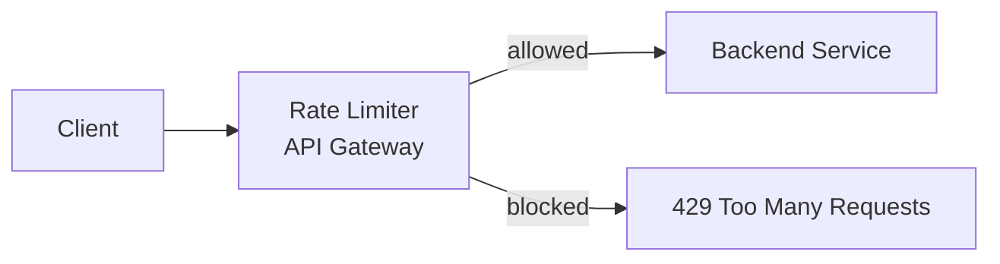
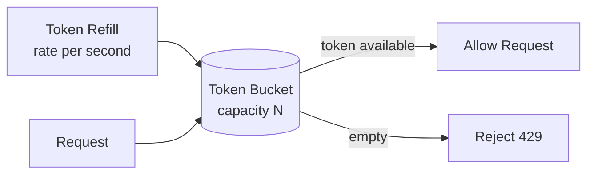
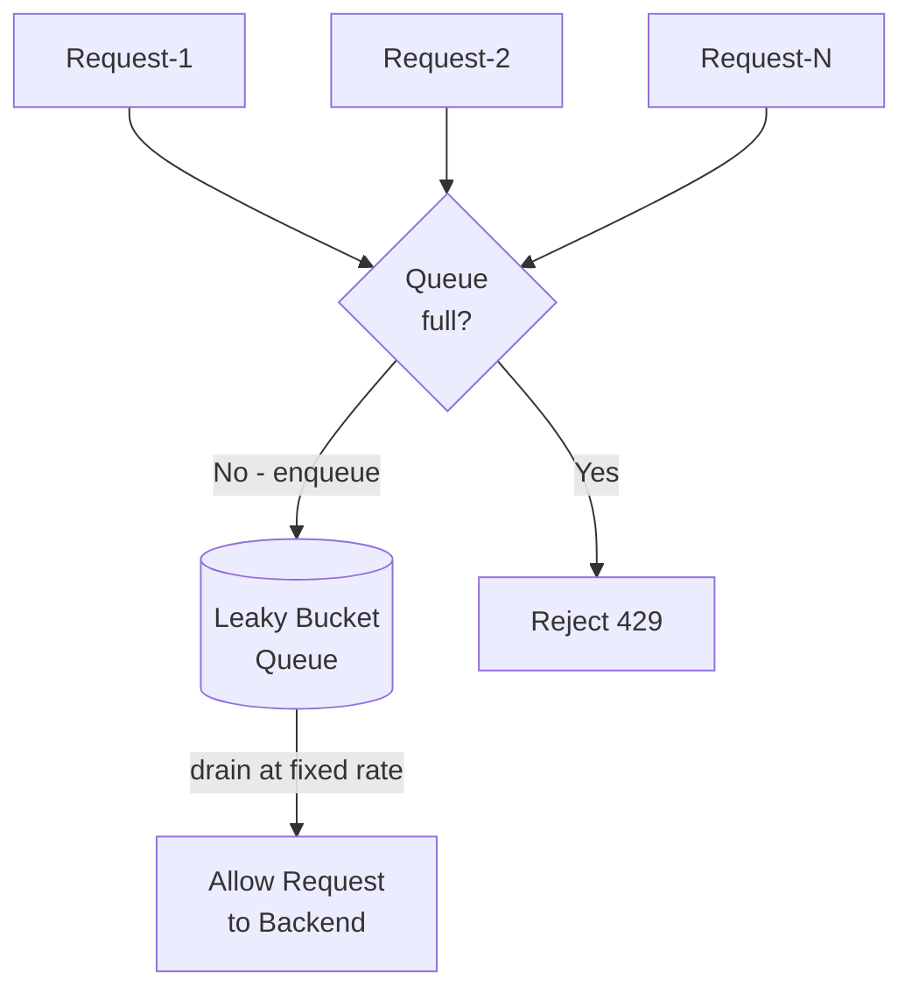
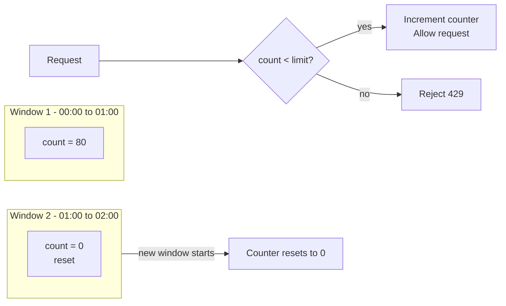
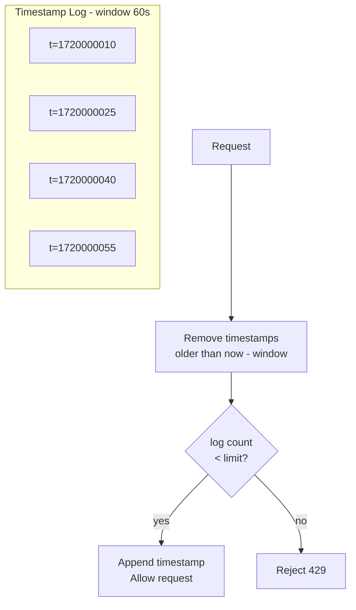
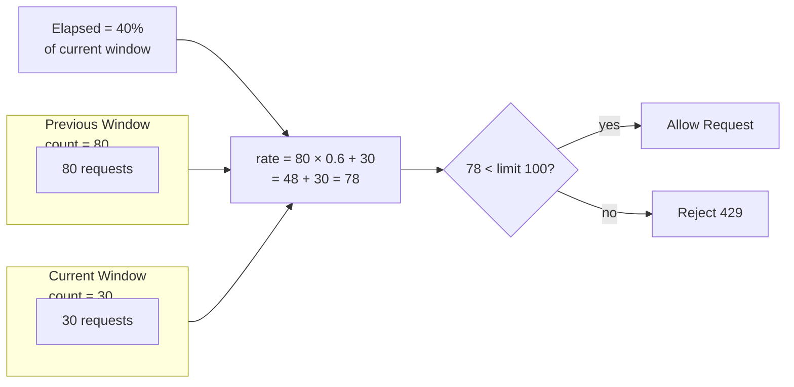
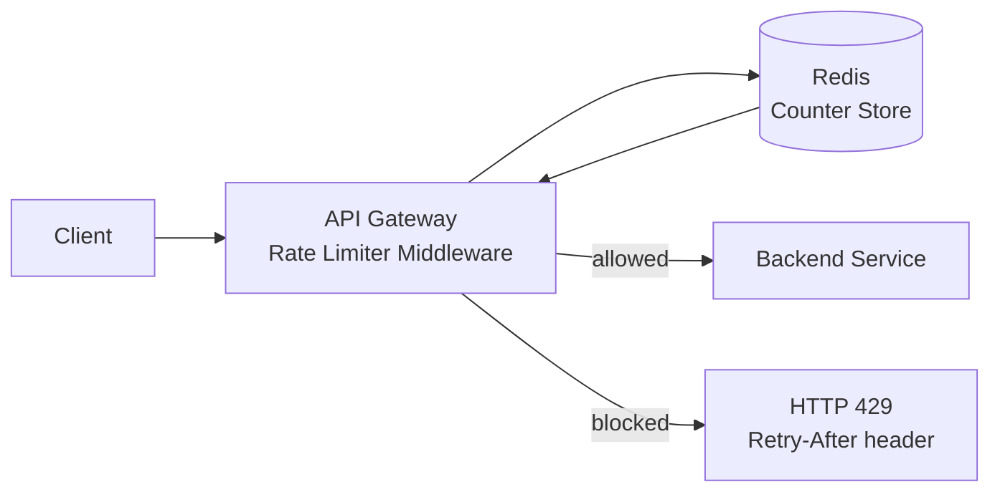
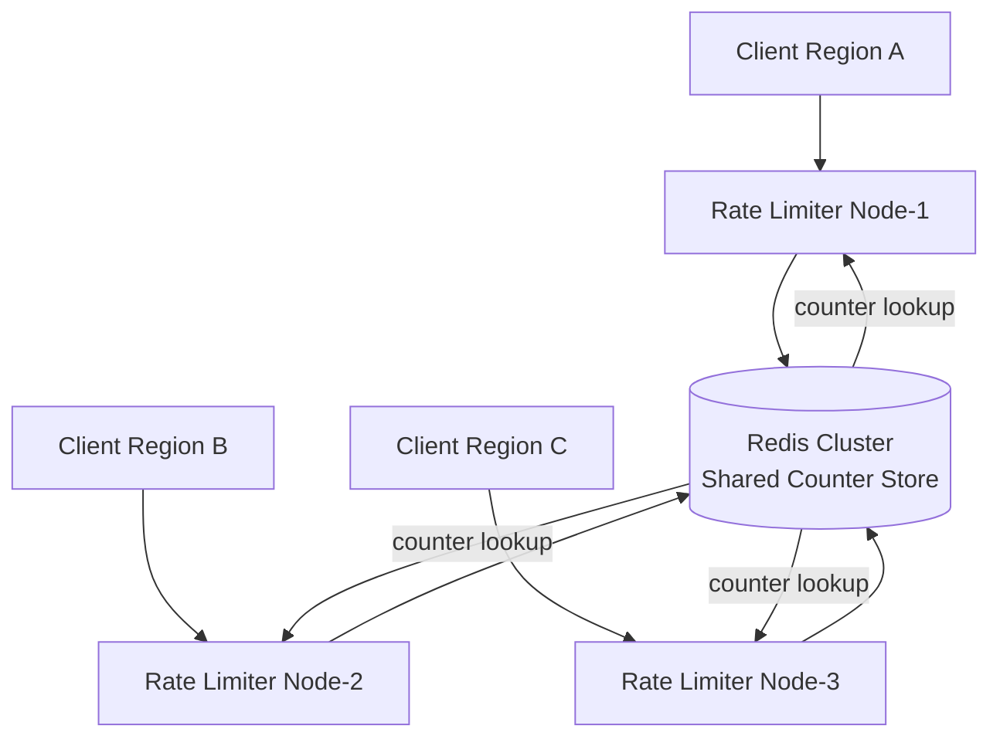
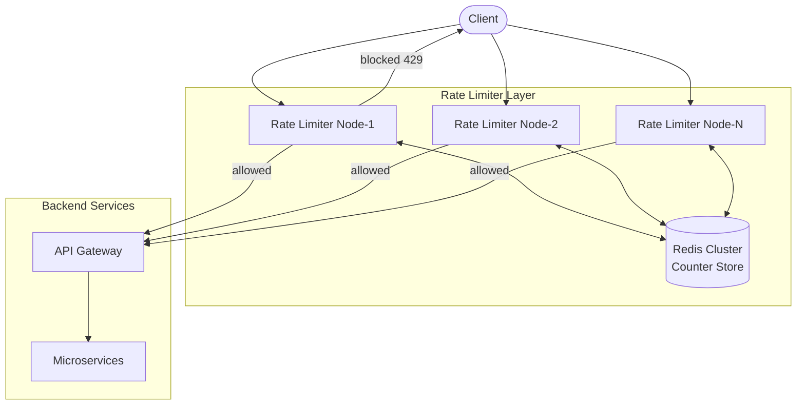

# High-Level Design: Rate Limiter

---

## 1) Why Rate Limiting is Required

### Problems Without Rate Limiting

#### DDoS (Distributed Denial of Service)
- An attacker floods the server with millions of requests per second
- Server resources get exhausted, legitimate users cannot be served
- Rate limiting detects and blocks traffic beyond an acceptable threshold

#### Brute Force Attacks
- Automated scripts try thousands of username/password combinations per minute
- Without limits, an attacker can crack accounts in seconds
- Rate limiting slows down or blocks login attempts beyond a safe count

#### API Abuse
- A single client makes excessive API calls that were not intended by the platform
- Overloads backend services and databases
- Rate limiting enforces fair usage per user, IP, or API key

#### Scraping and Bot Traffic
- Bots scrape data at machine speed from public APIs
- Degrades performance for real users
- Rate limiting detects abnormally fast request patterns and throttles them

#### Cost Control
- Uncontrolled API usage can cause unexpected infrastructure costs
- Rate limiting caps consumption per tier / customer plan

### Summary of Why Rate Limiting is Needed

| Problem           | Risk Without Rate Limiting        |
|-------------------|-----------------------------------|
| DDoS attack       | Server crash, full service outage |
| Brute force login | Account takeover                  |
| API abuse         | Unfair resource consumption       |
| Bot scraping      | Performance degradation           |
| Uncontrolled cost | Unexpected billing spike          |

---

## 2) What is a Rate Limiter

A rate limiter controls how many requests a client can make to a service in a given time window.

- **At the API Gateway**: protects all downstream services centrally
- **At the service level**: protects specific endpoints independently
- **At the client level**: per user id, per IP, per API key, per device

---

## 3) Where to Place a Rate Limiter



- Place **before** backend services so excess traffic is dropped early
- Can be embedded in API Gateway or as a standalone middleware

---

## 4) Rate Limiting Algorithms

### 4.1 Token Bucket

- A bucket holds a fixed number of tokens
- Tokens are added at a fixed rate
- Each request consumes one token
- If bucket is empty, request is rejected



**Pros**: allows burst traffic up to bucket size, smooth on average
**Cons**: bursts can still stress downstream if bucket is large

#### Implementation

```java
class TokenBucketRateLimiter {
    private final long capacity;       // max tokens
    private final double refillRate;   // tokens per second
    private double tokens;
    private long lastRefillTime;

    public synchronized boolean allowRequest() {
        refill();
        if (tokens >= 1) {
            tokens--;
            return true;  // allowed
        }
        return false;     // rejected 429
    }

    private void refill() {
        long now = System.currentTimeMillis();
        double elapsed = (now - lastRefillTime) / 1000.0;
        tokens = Math.min(capacity, tokens + elapsed * refillRate);
        lastRefillTime = now;
    }
}
```

### 4.2 Leaky Bucket

- Requests enter a queue
- Queue drains at a fixed rate regardless of incoming rate
- If queue is full, request is rejected



**Pros**: smooth, predictable output rate
**Cons**: no burst allowed, added latency from queue

#### Implementation

```java
class LeakyBucketRateLimiter {
    private final int capacity;          // max queue size
    private final long drainIntervalMs;  // ms between draining one request
    private final Queue<Runnable> queue = new LinkedList<>();
    private long lastDrainTime = System.currentTimeMillis();

    public synchronized boolean allowRequest(Runnable task) {
        drain();
        if (queue.size() < capacity) {
            queue.add(task);
            return true;   // enqueued, will be processed at fixed rate
        }
        return false;      // queue full, rejected 429
    }

    private void drain() {
        long now = System.currentTimeMillis();
        long elapsed = now - lastDrainTime;
        int toDrain = (int) (elapsed / drainIntervalMs);
        for (int i = 0; i < toDrain && !queue.isEmpty(); i++) {
            queue.poll().run();
        }
        lastDrainTime = now;
    }
}
```

### 4.3 Fixed Window Counter

- Time is divided into fixed windows (e.g. 1 minute)
- Counter increments per request in the current window
- Counter resets at the start of each new window



> ⚠️ Boundary burst: a client can send `limit` requests at 00:59 and another `limit` at 01:01, totalling 2x the intended limit in 2 seconds.

**Pros**: simple to implement
**Cons**: boundary burst problem — 2x traffic can pass at window edge

### 4.4 Sliding Window Log

- Stores timestamp of every request in a log
- On each request, remove entries older than the window
- Count remaining entries to check against limit



**Pros**: accurate, no boundary burst
**Cons**: high memory usage for storing all timestamps

### 4.5 Sliding Window Counter

- Hybrid of fixed window and sliding log
- Uses weighted average of current and previous window counts
- `rate = prev_window_count × (1 - elapsed_fraction) + current_window_count`



**Pros**: memory efficient, more accurate than fixed window
**Cons**: approximate, not perfectly accurate

### Algorithm Comparison

| Algorithm              | Burst Support            | Memory   | Accuracy  | Complexity |
|------------------------|--------------------------|----------|-----------|------------|
| Token Bucket           | Yes (up to capacity)     | Low      | Good      | Low        |
| Leaky Bucket           | No                       | Low      | High      | Low        |
| Fixed Window           | Partial (boundary issue) | Very low | Medium    | Very low   |
| Sliding Window Log     | Yes                      | High     | Very high | Medium     |
| Sliding Window Counter | Limited                  | Low      | Good      | Medium     |

---

## 5) Rate Limiter Architecture

### Simple Architecture



### Multi-Region / Distributed Architecture



- All rate limiter nodes share state via Redis Cluster
- Redis atomic `INCR` and `EXPIRE` commands ensure consistency
- Lua scripts used for atomic check-and-increment

---

## 6) Redis Key Schema

```text
rate_limit:{identifier}:{windowTimestamp}  =  count
EXPIRE = window duration (TTL)
```

Example:

```text
rate_limit:user_1001:1720000000 = 42
rate_limit:ip_192.168.1.1:1720000060 = 7
rate_limit:api_key_xyz:1720000120 = 100
```

---

## 7) Response Headers

When a rate limit is enforced, return informative headers so clients can handle retries:

```text
HTTP/1.1 429 Too Many Requests
X-RateLimit-Limit: 100
X-RateLimit-Remaining: 0
X-RateLimit-Reset: 1720000060
Retry-After: 30
```

| Header                  | Meaning                               |
|-------------------------|---------------------------------------|
| `X-RateLimit-Limit`     | Max requests allowed in the window    |
| `X-RateLimit-Remaining` | Requests remaining in current window  |
| `X-RateLimit-Reset`     | Unix timestamp when the window resets |
| `Retry-After`           | Seconds until the client should retry |

---

## 8) Rate Limiting Dimensions

Rate limits can be applied at different granularities:

- **Per IP address**: protect against DDoS from a single source
- **Per user ID**: fair usage per authenticated user
- **Per API key**: quota enforcement per client/tenant
- **Per endpoint**: stricter limits on expensive or sensitive operations
- **Per device**: mobile or browser client limits

---

## 9) Non-Functional Considerations

| Concern                 | Solution                                          |
|-------------------------|---------------------------------------------------|
| Low latency             | Use Redis in-memory lookups                       |
| High availability       | Redis Cluster with replication                    |
| Fault tolerance         | Fail open or fail closed strategy on Redis outage |
| Distributed consistency | Atomic Lua scripts or Redis `INCR` + `EXPIRE`     |
| Scalability             | Horizontally scale rate limiter nodes behind LB   |

---

## 10) Final Architecture Diagram



---

## Summary

A rate limiter protects systems from DDoS, brute force, API abuse, and uncontrolled costs. It works by tracking request counts per client identity in a shared counter store (Redis). The most practical algorithm for most systems is the **sliding window counter** for accuracy and low memory usage. In distributed systems, rate limiter nodes share state via Redis Cluster with atomic operations to ensure consistent enforcement across all nodes.

