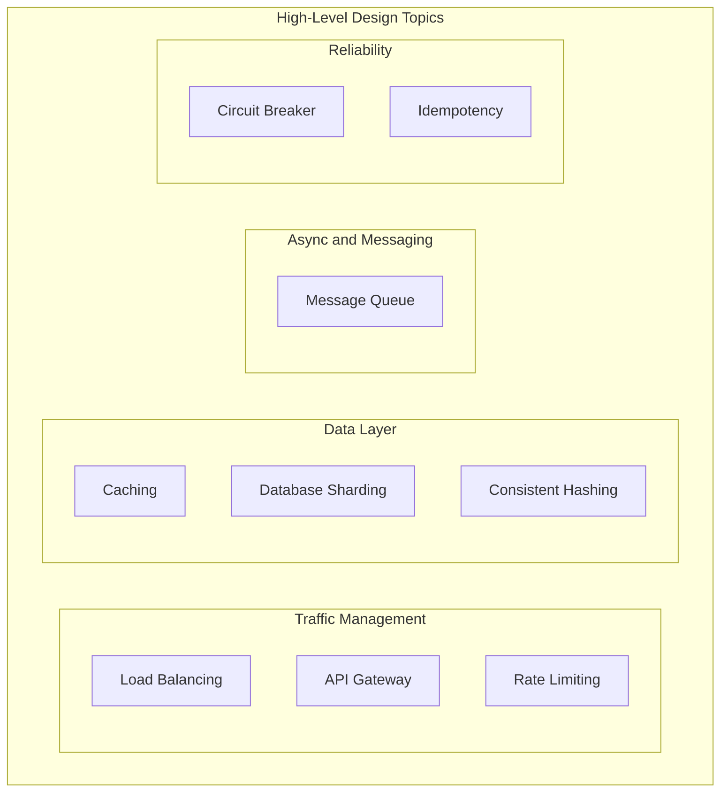

# High-Level Design - Topic Map

## Notes

- `Load Balancing`: distributes traffic across multiple servers.
- `API Gateway`: centralized auth, routing, throttling, and aggregation.
- `Rate Limiting`: protects services from overuse and abuse.
- `Caching`: reduces DB load and latency.
- `Database Sharding`: partitions data across DB nodes.
- `Consistent Hashing`: minimizes key remapping when nodes change.
- `Message Queue`: decouples producers and consumers asynchronously.
- `Circuit Breaker`: prevents cascading failures.
- `Idempotency`: ensures retries do not duplicate effects.

