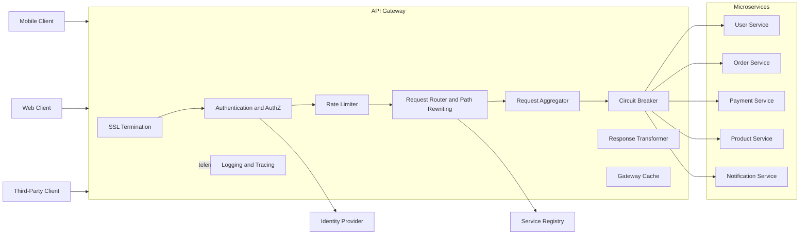

# High-Level Design: API Gateway

## Responsibilities

- SSL/TLS termination
- Authentication and authorization
- Rate limiting and throttling
- Routing and load balancing
- Request/response transformation
- Circuit breaking and fallback
- Caching and observability

