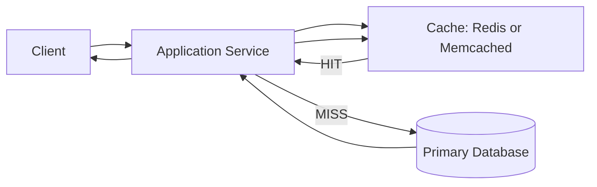

# High-Level Design: Caching Strategies

## Strategies

- `Cache-Aside`: read cache first, then DB on miss, then populate cache.
- `Write-Through`: write to cache and DB synchronously.
- `Write-Back`: write to cache first, flush to DB asynchronously.
- `Read-Through`: cache layer fetches from DB on miss.

## Operational Notes

- Eviction policies: `LRU`, `LFU`, `FIFO`, `TTL`.
- Common risks: cache stampede, penetration, avalanche, thundering herd.
- Database remains the source of truth.

