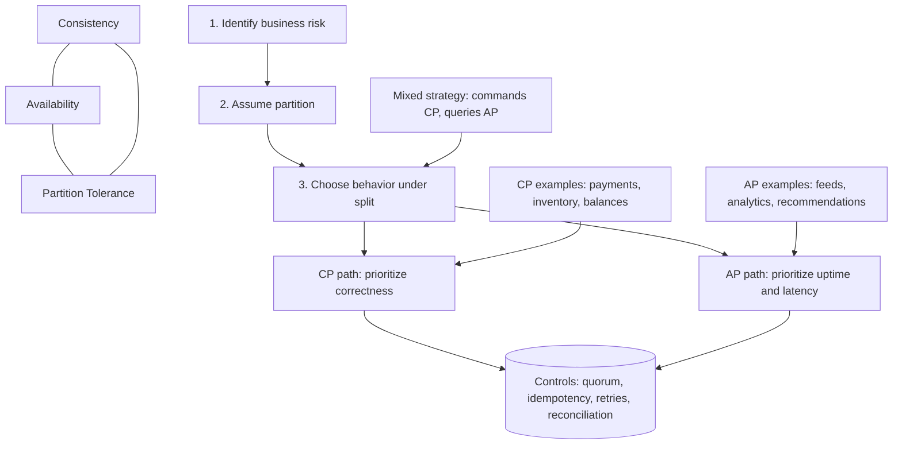

# High-Level Design: CAP Theorem Decision Matrix

## Interview One-Liner

Under partition, choose `CP` or `AP` per workflow based on business risk, then apply controls like quorum, idempotency, retries, and reconciliation.

