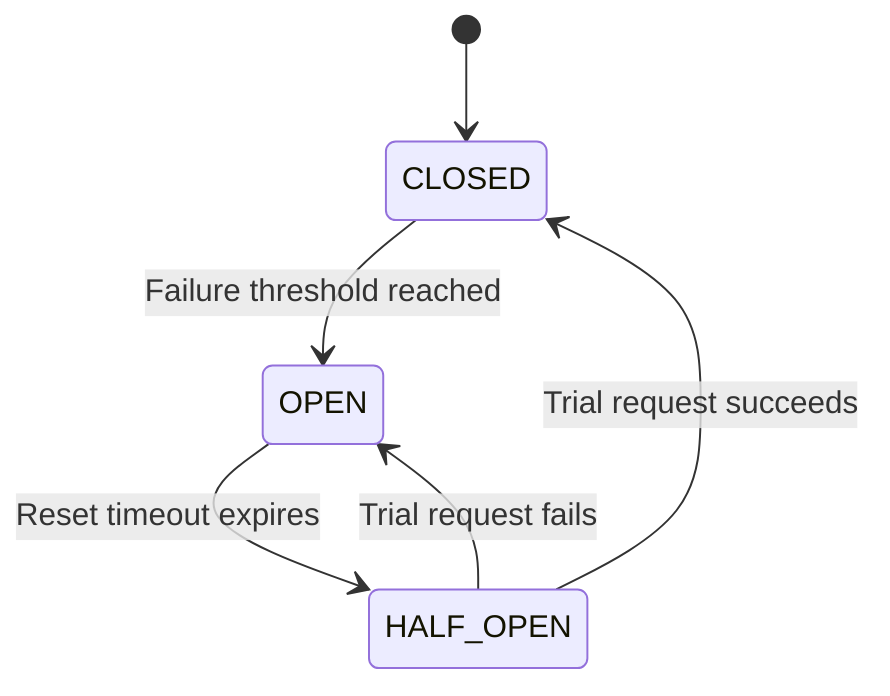
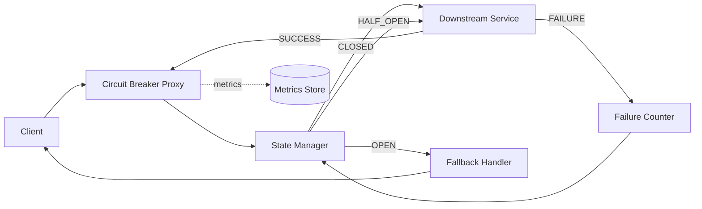

# High-Level Design: Circuit Breaker Pattern

## State Machine

## Component Flow

## Typical Configuration

- `failureRateThreshold`: 50%
- `minimumCallCount`: 10
- `slidingWindowSize`: 60 sec
- `openStateDuration`: 30 sec
- `halfOpenPermittedCalls`: 3

