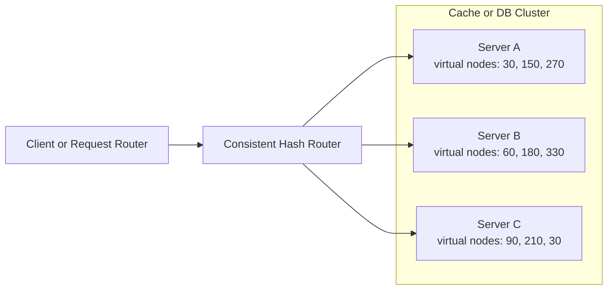

# High-Level Design: Consistent Hashing

## Key Ideas

- Hash keys onto a circular ring.
- Route each key to the first server clockwise on the ring.
- Use virtual nodes for better distribution.
- Adding/removing a server remaps only a fraction of keys (about `1/N`).

