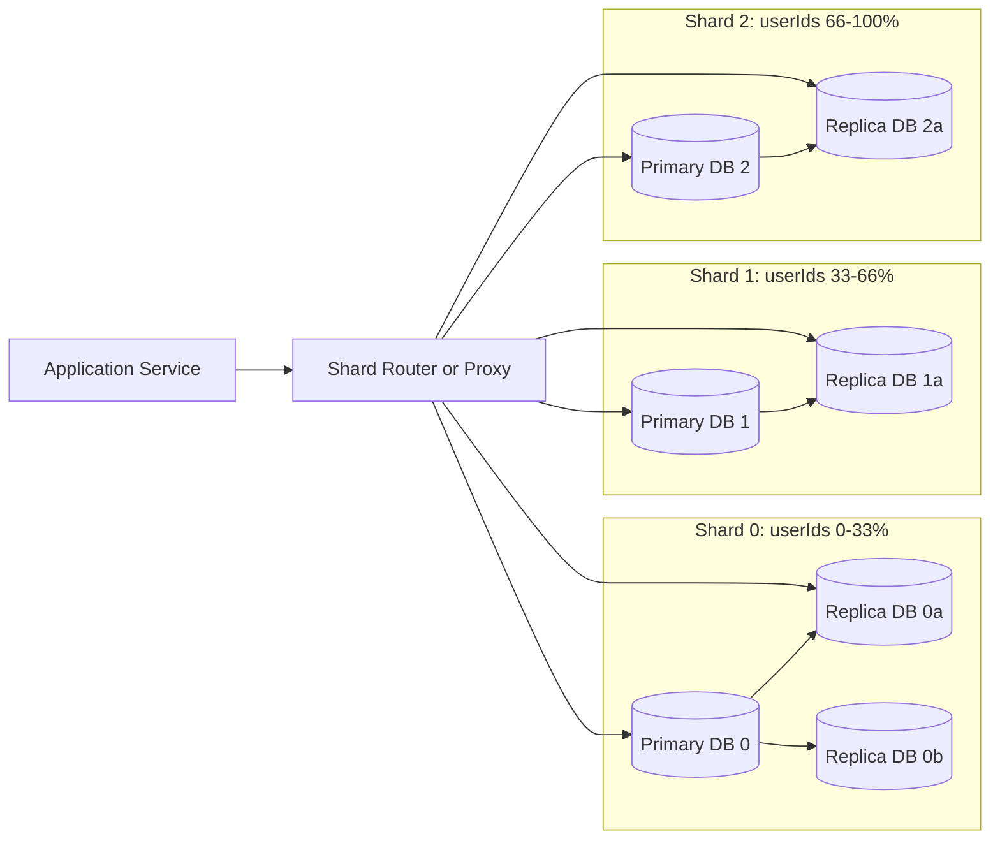

# High-Level Design: Database Sharding and Replication

## Notes

- Writes and strong reads usually go to primaries.
- Eventual reads can go to replicas.
- Common sharding options: `Hash`, `Range`, `Directory`, `Geo`.
- Cross-shard joins and resharding need careful design.

