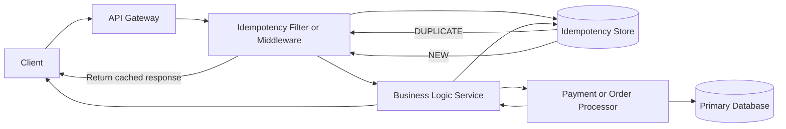

# High-Level Design: Idempotent API / Service

## Idempotency Rules

- Client sends `Idempotency-Key` header (usually UUID).
- Key is unique per logical operation.
- Store key + request hash + response + status + expiry (TTL).
- Duplicate key returns previously stored response safely.

