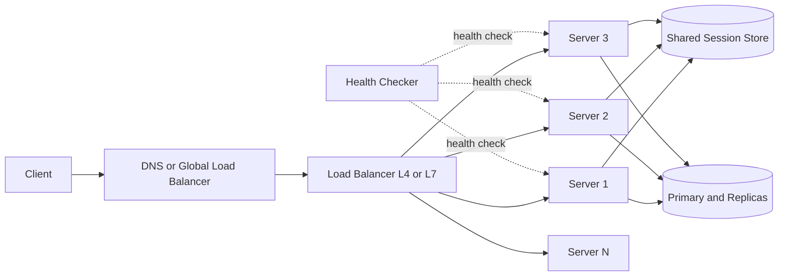

# High-Level Design: Load Balancing

```mermaid
flowchart LR
    Client --> DNS[DNS or Global Load Balancer]
    DNS --> LB[Load Balancer L4 or L7]

    LB --> S1[Server 1]
    LB --> S2[Server 2]
    LB --> S3[Server 3]
    LB --> SN[Server N]

    HC[Health Checker] -. health check .-> S1
    HC -. health check .-> S2
    HC -. health check .-> S3

    S1 --> Session[(Shared Session Store)]
    S2 --> Session
    S3 --> Session

    S1 --> DB[(Primary and Replicas)]
    S2 --> DB
    S3 --> DB
```

## Routing Algorithms

- `Round Robin`
- `Weighted Round Robin`
- `Least Connections`
- `IP Hash` (sticky sessions)
- `Random`

