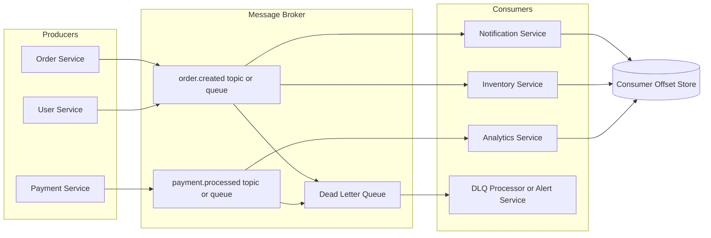

# High-Level Design: Message Queue / Async Messaging

## Delivery Semantics

- `At-most-once`: may lose messages.
- `At-least-once`: may duplicate messages.
- `Exactly-once`: strongest but hardest.

