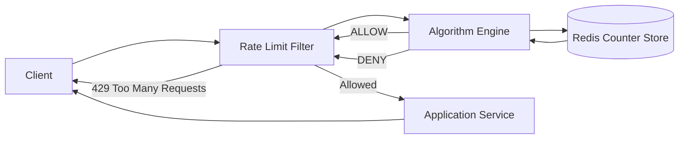

# High-Level Design: Rate Limiting

## Common Algorithms

- `Token Bucket`: allows bursts up to bucket size.
- `Leaky Bucket`: smooth output at fixed drain rate.
- `Fixed Window`: simple but bursty at boundaries.
- `Sliding Window Log`: accurate, memory-heavy.
- `Sliding Window Counter`: balanced accuracy and cost.

## Typical Headers

- `X-RateLimit-Limit`
- `X-RateLimit-Remaining`
- `X-RateLimit-Reset`
- `Retry-After`

