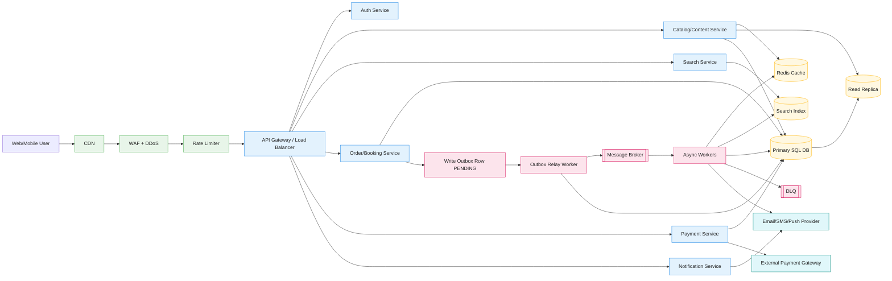

# Online Application HLD Diagram (GitHub Renderable)

This file uses a **Mermaid** diagram so it renders directly on GitHub after commit.

## How to explain this in interview

1. Requests go through edge security (`CDN`, `WAF`, `Rate Limiter`) and then API gateway.
2. Services are stateless and horizontally scalable.
3. `SQL DB` is source of truth; `Redis` and `Read Replica` optimize read latency.
4. Write reliability uses **Transactional Outbox** + relay + message broker.
5. Async workers decouple slow tasks; failed events go to `DLQ`.
6. Search is handled by separate search index for text/filter heavy queries.

