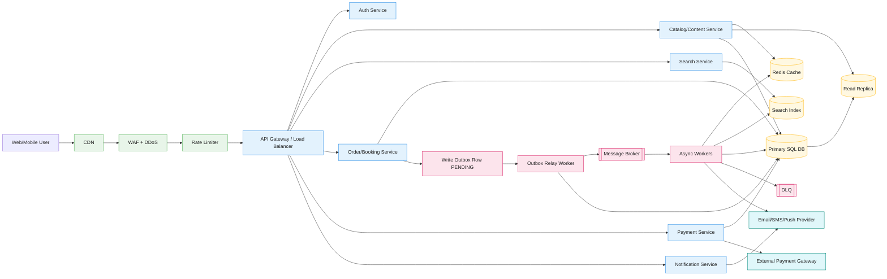
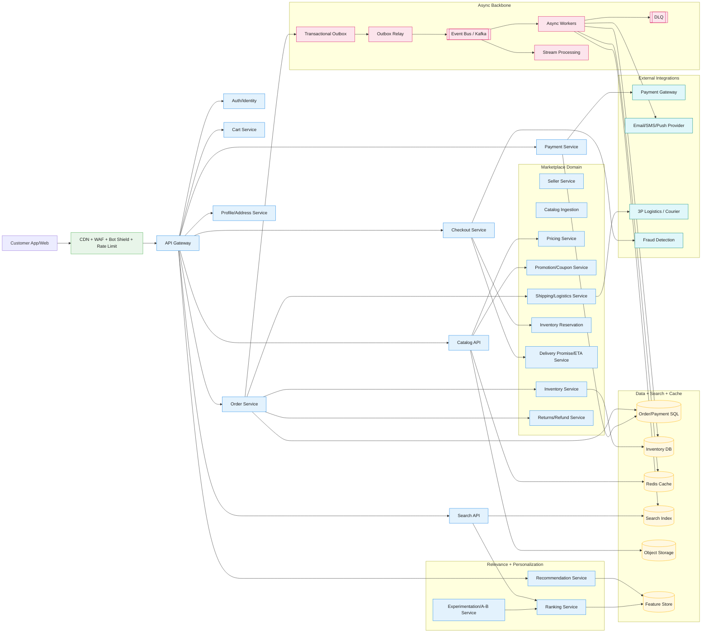

# Online Application HLD Diagram

## How to explain this in interview

1. Requests go through edge security (`CDN`, `WAF`, `Rate Limiter`) and then API gateway.
2. Services are stateless and horizontally scalable.
3. `SQL DB` is source of truth; `Redis` and `Read Replica` optimize read latency.
4. Write reliability uses **Transactional Outbox** + relay + message broker.
5. Async workers decouple slow tasks; failed events go to `DLQ`.
6. Search is handled by separate search index for text/filter heavy queries.

---

## Keyword glossary (interview quick reference)

### Security and edge terms
- **CDN (Content Delivery Network):** Global edge servers that cache static content (images, JS, CSS, videos) close to users to reduce latency.
- **WAF (Web Application Firewall):** Filters malicious HTTP traffic (for example SQL injection, XSS, bot abuse) before it hits application servers.
- **DDoS (Distributed Denial of Service):** Attack where many machines flood your system with traffic; mitigation usually happens at CDN/WAF/network edge.
- **Rate Limiter:** Limits request rate per user/IP/token to prevent abuse and protect backend capacity.
- **TLS:** Encryption for traffic in transit (HTTPS).

### API and service terms
- **API Gateway:** Single entry layer for routing, auth checks, throttling, request validation, and observability.
- **Load Balancer (LB):** Distributes traffic across multiple service instances for availability and scale.
- **Stateless service:** Service that does not store session state in local memory, so any instance can serve any request.
- **Horizontal scaling:** Add more service instances instead of adding a larger single machine.

### Data and reliability terms
- **Primary SQL DB:** Main transactional database (source of truth) for strongly consistent writes.
- **Read Replica:** Read-only copy of primary DB for scaling read traffic.
- **Redis cache:** In-memory store for low-latency hot reads and temporary state.
- **Search Index:** Specialized index (like OpenSearch/Elasticsearch) for full-text search and filtering.
- **Transactional Outbox:** Pattern where business row and event row are written in one DB transaction.
- **Outbox Relay Worker:** Background job that publishes pending outbox events to broker and updates outbox status.
- **Message Broker:** Durable async transport (Kafka/RabbitMQ/SQS) between producers and consumers.
- **DLQ (Dead Letter Queue):** Queue for messages that repeatedly fail processing after max retries.
- **Idempotency:** Ability to safely retry requests/events without duplicate side effects.

### External integration terms
- **Payment Gateway:** External provider for payment authorization/capture/refund.
- **Email/SMS/Push provider:** External communication platform for notifications.

---

## Component-by-component explanation of this diagram

### 1) `U` - Web/Mobile User
- Starts request flow (browse, search, place order/booking).
- Expects low latency and reliable confirmation.

### 2) `CDN`
- Serves static content directly from edge.
- Reduces backend traffic and improves global response time.

### 3) `WAF + DDoS`
- Inspects incoming traffic and blocks suspicious patterns.
- Helps absorb attack traffic before it reaches core services.

### 4) `RL` - Rate Limiter
- Enforces per-user/IP quotas.
- Prevents abuse and controls traffic spikes.

### 5) `GW` - API Gateway / Load Balancer
- Routes request to correct service (`AUTH`, `CAT`, `ORDER`, etc.).
- Common place for auth checks, request IDs, tracing, and throttling.

### 6) Domain services (`AUTH`, `CAT`, `SEARCH`, `ORDER`, `PAY`, `NOTIF`)
- **`AUTH`:** Login/session/token validation.
- **`CAT`:** Product/content metadata APIs.
- **`SEARCH`:** Query, filter, ranking over index.
- **`ORDER`:** Core write workflow for transaction/order/booking.
- **`PAY`:** Payment state management + gateway integration.
- **`NOTIF`:** Notification orchestration.

### 7) Data stores (`SQL`, `RR`, `REDIS`, `IDX`)
- **`SQL`:** Strongly consistent transactional writes.
- **`RR`:** Scale read-heavy endpoints without overloading primary.
- **`REDIS`:** Cache hot data to improve P95 latency.
- **`IDX`:** Search-optimized views for text/filter/sort queries.

### 8) Transactional outbox path (`OUTBOX` -> `RELAY` -> `MQ`)
- `ORDER` writes business row and outbox event row (`PENDING`) in same transaction.
- `RELAY` polls pending outbox rows.
- On success: publishes event to `MQ` and marks outbox event as published.
- On failure: retries; after repeated failures route handling to `DLQ` path.

### 9) Async processing (`WORKERS`)
- Consumers process events independently.
- Update cache/index/projections without blocking user request path.
- Enables eventual consistency and better write throughput.

### 10) External systems (`PGW`, `COMM`)
- **`PGW`:** Real money operations; requires retries, idempotency keys, and reconciliation jobs.
- **`COMM`:** Send user-facing notifications (email/SMS/push).

### 11) `DLQ`
- Isolates poison/unprocessable events.
- Prevents infinite retries from harming healthy message flow.
- Used with alerting + replay tooling.

---

## End-to-end flows in this diagram

### Read flow
1. User request -> edge (`CDN/WAF/RL`) -> `GW`.
2. `CAT` serves from `REDIS` if available.
3. Fallback to `RR`/`SQL` and repopulate cache.
4. For search queries, `SEARCH` reads from `IDX`.

### Write flow
1. User action -> `ORDER`/`PAY` via `GW`.
2. Write to `SQL` (source of truth).
3. Also write outbox row (`OUTBOX`) in same transaction.
4. `RELAY` publishes to `MQ`.
5. `WORKERS` perform async tasks (notifications, index updates, projections).
6. Failed processing goes to `DLQ` after retry limit.

---

## Interview tips while presenting this diagram

- Start with **user request path**, then separate **read path** and **write path**.
- Explicitly mention where you need **strong consistency** (`SQL`, payments, inventory).
- Highlight where **eventual consistency** is acceptable (`IDX`, notifications, projections).
- Mention **idempotency** for both API retries and event consumers.
- Mention observability hooks: request IDs, tracing, queue lag, retry and DLQ metrics.

---

## Key architectural trade-offs (must discuss in interview)

### 1) Monolith vs microservices
- **Monolith pros:** simpler deploy/debug, fewer moving parts, faster early-stage delivery.
- **Monolith cons:** scaling and team ownership bottlenecks over time.
- **Microservices pros:** independent scaling/deployments, better team autonomy.
- **Microservices cons:** distributed complexity (network failures, tracing, consistency).
- **When to say in interview:** "For v1, I start modular monolith; split high-traffic bounded contexts later."

### 2) Strong consistency vs eventual consistency
- **Strong consistency pros:** prevents incorrect states in money/inventory workflows.
- **Strong consistency cons:** higher latency and tighter coupling.
- **Eventual consistency pros:** better availability and throughput with async processing.
- **Eventual consistency cons:** temporary stale reads and reconciliation needs.
- **When to say in interview:** "I keep strong consistency for order-payment-inventory writes, eventual consistency for search, analytics, and notifications."

### 3) Synchronous calls vs async messaging
- **Sync pros:** simple request-response model, immediate feedback.
- **Sync cons:** cascading failure risk and higher tail latency.
- **Async pros:** decoupling, burst handling, retry capability.
- **Async cons:** operational overhead (broker, retries, DLQ, out-of-order handling).
- **When to say in interview:** "Critical confirmation stays synchronous; non-critical side effects are async through broker."

### 4) Cache-heavy reads vs direct DB reads
- **Cache pros:** low latency, reduced DB load, better peak performance.
- **Cache cons:** invalidation complexity, stale data risk, memory cost.
- **Direct DB pros:** simpler correctness model.
- **Direct DB cons:** poor scalability for read-heavy traffic.
- **When to say in interview:** "I cache hot keys with TTL and event-based invalidation, but fall back to DB as source of truth."

### 5) SQL vs NoSQL for primary writes
- **SQL pros:** ACID transactions, mature indexing/joins, strong integrity.
- **SQL cons:** sharding complexity at very high scale.
- **NoSQL pros:** flexible schema and horizontal partitioning.
- **NoSQL cons:** weaker transactional guarantees (depending on engine).
- **When to say in interview:** "For transaction-heavy domains, SQL first; add NoSQL for specific high-scale access patterns if needed."

### 6) Read replica scaling vs DB sharding
- **Read replicas pros:** quick way to offload reads.
- **Read replicas cons:** replication lag, no write scaling.
- **Sharding pros:** write/read horizontal scale.
- **Sharding cons:** cross-shard queries/transactions become complex.
- **When to say in interview:** "Scale reads first with replicas; shard only when primary write or storage limits are reached."

### 7) Outbox pattern vs direct publish in request path
- **Outbox pros:** prevents dual-write loss and improves reliability.
- **Outbox cons:** extra table + relay + monitoring complexity.
- **Direct publish pros:** fewer components.
- **Direct publish cons:** message loss/inconsistency risk on partial failure.
- **When to say in interview:** "I prefer transactional outbox for correctness in business-critical events."

### 8) Single region vs multi-region
- **Single region pros:** simpler ops, lower consistency complexity.
- **Single region cons:** weaker disaster resilience and higher latency for distant users.
- **Multi-region pros:** better resilience and lower global latency.
- **Multi-region cons:** data conflict handling, higher cost and ops overhead.
- **When to say in interview:** "Start single region multi-AZ, then move to active-passive multi-region for DR, and active-active only if justified."

### 9) At-least-once vs exactly-once processing
- **At-least-once pros:** practical and robust in distributed systems.
- **At-least-once cons:** duplicates must be handled.
- **Exactly-once pros:** cleaner consumer semantics.
- **Exactly-once cons:** expensive/complex across service boundaries.
- **When to say in interview:** "I design for at-least-once delivery and enforce idempotent consumers."

### 10) Immediate deletion vs soft delete + retention
- **Immediate delete pros:** smaller storage footprint.
- **Immediate delete cons:** weak auditability and recovery.
- **Soft delete pros:** audit, rollback, compliance support.
- **Soft delete cons:** larger storage and data lifecycle jobs required.
- **When to say in interview:** "Use soft-delete for critical entities, then archive/tier old data by retention policy."

---

## 30-second trade-off summary to speak in interview

"My design optimizes for correctness on critical writes and scalability on reads. I use SQL and transactional outbox for reliable state changes, while caches, read replicas, and async workers reduce latency and absorb spikes. This introduces operational complexity, so I mitigate with observability, retries, DLQ, and idempotency. I would evolve from simpler deployment (single region, fewer services) to more distributed architecture only when scale and reliability targets demand it."

## Amazon/Flipkart-grade improvements (marketplace-scale design)

If you want to explain this as a large e-commerce marketplace (Amazon/Flipkart style), add these components and flows.

### What changes from generic HLD to marketplace HLD
- Add **Marketplace domain services**: Seller, Catalog ingestion, Pricing, Promotion, Inventory reservation, Cart, Checkout, Delivery promise, Returns.
- Add **Personalization layer**: Recommendations, ranking, user behavior features.
- Add **High-throughput event streaming** for clickstream, order events, and inventory events.
- Add **Search relevance pipeline**: ingestion, indexing, ranking, A/B experimentation.
- Add **Operational controls**: fraud/risk scoring, anti-abuse, observability-by-default, replay pipelines.

---

## Marketplace-scale architecture diagram (GitHub renderable)

---

## What to say for Amazon/Flipkart interview depth

### 1) Catalog and seller scale
- Separate **seller onboarding** and **catalog ingestion** from customer-facing read APIs.
- Pre-validate and normalize product data before indexing.
- Use async pipelines for media processing and catalog enrichment.

### 2) Price and promotion correctness
- Price is often dynamic (base + seller + campaign + coupon + user segment).
- Compute final payable price in checkout with deterministic rule ordering.
- Keep audit trail for price decisions and promotion application.

### 3) Inventory consistency
- Use **reservation** during checkout with TTL (soft lock).
- Confirm reservation on successful payment; release on timeout/failure.
- Strong consistency for stock decrement path, eventual consistency for stock display.

### 4) Checkout reliability
- Use idempotency keys for `place-order` and payment callbacks.
- Keep order + outbox in single transaction.
- Make downstream operations async (invoice, notifications, analytics).

### 5) Search and relevance
- Separate online serving (`SEARCH API`) from offline/stream indexing.
- Relevance ranking combines text score + popularity + availability + personalization.
- A/B testing service controls ranking models and rollout.

### 6) Personalization and recommendations
- Feature store provides low-latency user/item features.
- Candidate generation + ranking stage architecture.
- Fall back to popular/trending when personalization signals are missing.

### 7) Returns and reverse logistics
- Model return eligibility rules (window, category, condition, seller policy).
- Decouple reverse pickup/refund workflows using events and state machine.
- Refund path should be idempotent and auditable.

---

## Marketplace-specific trade-offs interviewers ask

### A) Pre-compute vs real-time compute (price, ETA, recommendations)
- **Pre-compute:** lower latency, higher storage/staleness risk.
- **Real-time:** fresh results, higher compute cost/latency.
- Practical answer: hybrid (pre-compute base features, real-time final adjustments).

### B) Inventory reservation strictness
- **Strict lock:** fewer oversells, may reduce conversion during high contention.
- **Soft lock with TTL:** better UX throughput, needs compensating logic.
- Practical answer: soft lock + reconciliation + seller-side safety buffers.

### C) Search freshness vs indexing cost
- **Near real-time indexing:** fresher search, higher infra cost.
- **Batch indexing:** cheaper, stale search window.
- Practical answer: high-priority updates (price/stock) near real-time, others batched.

### D) Single checkout orchestration service vs distributed saga
- **Central orchestrator:** simpler control flow, possible bottleneck.
- **Saga/choreography:** scalable/flexible, harder debugging.
- Practical answer: start orchestrator-led saga, evolve based on team/service maturity.

### E) Own logistics vs 3P logistics integration
- **Own logistics:** better control and potentially better SLA, higher capex/ops complexity.
- **3P logistics:** faster launch, less control over delivery quality.
- Practical answer: hybrid by region/category and SLA requirement.

---

## 60-second Amazon/Flipkart style summary

"At marketplace scale, I split the system into customer-facing APIs and heavy back-office pipelines like seller onboarding, catalog ingestion, and search indexing. Checkout is reliability-first: idempotent APIs, transactional outbox, and event-driven downstream processing. Inventory uses reservation with TTL to minimize oversell while maintaining conversion. Search and recommendations are separate relevance systems with feature store + A/B testing. I keep strong consistency for payment/order/inventory commit paths and eventual consistency for projections, personalization, and notifications."

