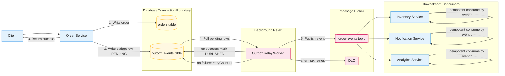

# Transactional Outbox - High Level Diagram

This Mermaid diagram renders directly on GitHub and explains the full outbox flow.

## How to read this quickly

1. `Order Service` writes `orders` and `outbox_events` in the same DB transaction.
2. Client gets success as soon as transaction commits.
3. Relay publishes pending outbox events to broker asynchronously.
4. On failure, relay retries and finally routes poison events to `DLQ`.
5. Consumers process events idempotently (safe on duplicate delivery).

## Interview one-liner

"Transactional outbox avoids dual-write inconsistency by committing business data and event record atomically, then asynchronously publishing with retries and idempotent consumption."
