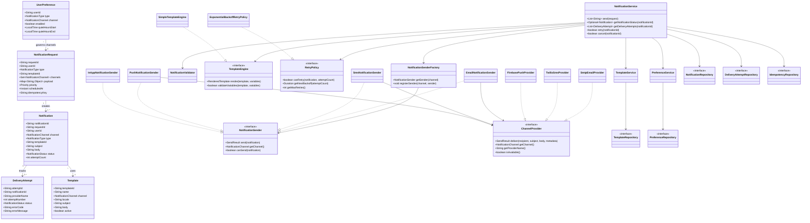

# Notification Service - Class Diagram

```mermaid
classDiagram

%% =========================
%% Domain Entities
%% =========================
class NotificationRequest {
  +String requestId
  +String userId
  +NotificationType type
  +String templateId
  +Set~NotificationChannel~ channels
  +Map~String,Object~ payload
  +Priority priority
  +Instant scheduledAt
  +String idempotencyKey
}

class Notification {
  +String notificationId
  +String requestId
  +String userId
  +NotificationChannel channel
  +NotificationType type
  +String templateId
  +String subject
  +String body
  +NotificationStatus status
  +int attemptCount
}

class Template {
  +String templateId
  +String name
  +NotificationChannel channel
  +String locale
  +String subject
  +String body
  +boolean active
}

class DeliveryAttempt {
  +String attemptId
  +String notificationId
  +String providerName
  +int attemptNumber
  +NotificationStatus status
  +String errorCode
  +String errorMessage
}

class UserPreference {
  +String userId
  +NotificationType type
  +NotificationChannel channel
  +boolean enabled
  +LocalTime quietHoursStart
  +LocalTime quietHoursEnd
}

%% =========================
%% Core Service
%% =========================
class NotificationService {
  +List~String~ send(request)
  +Optional~Notification~ getNotificationStatus(notificationId)
  +List~DeliveryAttempt~ getDeliveryAttempts(notificationId)
  +boolean retry(notificationId)
  +boolean cancel(notificationId)
}

class TemplateService
class PreferenceService
class NotificationValidator

%% =========================
%% Abstractions
%% =========================
class NotificationSender {
  <<interface>>
  +SendResult send(notification)
  +NotificationChannel getChannel()
  +boolean canSend(notification)
}

class ChannelProvider {
  <<interface>>
  +SendResult deliver(recipient, subject, body, metadata)
  +NotificationChannel getChannel()
  +String getProviderName()
  +boolean isAvailable()
}

class TemplateEngine {
  <<interface>>
  +RenderedTemplate render(template, variables)
  +boolean validateVariables(template, variables)
}

class RetryPolicy {
  <<interface>>
  +boolean canRetry(notification, attemptCount)
  +Duration getNextBackoff(attemptCount)
  +int getMaxRetries()
}

%% =========================
%% Factories and Implementations
%% =========================
class NotificationSenderFactory {
  +NotificationSender getSender(channel)
  +void registerSender(channel, sender)
}

class EmailNotificationSender
class SmsNotificationSender
class PushNotificationSender
class InAppNotificationSender

class SmtpEmailProvider
class TwilioSmsProvider
class FirebasePushProvider

class SimpleTemplateEngine
class ExponentialBackoffRetryPolicy

%% =========================
%% Repositories
%% =========================
class NotificationRepository {
  <<interface>>
}
class TemplateRepository {
  <<interface>>
}
class PreferenceRepository {
  <<interface>>
}
class DeliveryAttemptRepository {
  <<interface>>
}
class IdempotencyRepository {
  <<interface>>
}

%% =========================
%% Service dependencies
%% =========================
NotificationService --> NotificationValidator
NotificationService --> TemplateService
NotificationService --> PreferenceService
NotificationService --> TemplateEngine
NotificationService --> RetryPolicy
NotificationService --> NotificationSenderFactory
NotificationService --> NotificationRepository
NotificationService --> DeliveryAttemptRepository
NotificationService --> IdempotencyRepository

TemplateService --> TemplateRepository
PreferenceService --> PreferenceRepository

%% =========================
%% Strategy/factory wiring
%% =========================
NotificationSenderFactory --> NotificationSender
EmailNotificationSender ..|> NotificationSender
SmsNotificationSender ..|> NotificationSender
PushNotificationSender ..|> NotificationSender
InAppNotificationSender ..|> NotificationSender

SmtpEmailProvider ..|> ChannelProvider
TwilioSmsProvider ..|> ChannelProvider
FirebasePushProvider ..|> ChannelProvider

EmailNotificationSender --> ChannelProvider
SmsNotificationSender --> ChannelProvider
PushNotificationSender --> ChannelProvider

SimpleTemplateEngine ..|> TemplateEngine
ExponentialBackoffRetryPolicy ..|> RetryPolicy

%% =========================
%% Domain relationships
%% =========================
NotificationRequest "1" --> "1..*" Notification : creates
Notification "1" --> "0..*" DeliveryAttempt : tracks
Notification "*" --> "1" Template : uses
UserPreference "*" --> "1" NotificationRequest : governs channels
```

