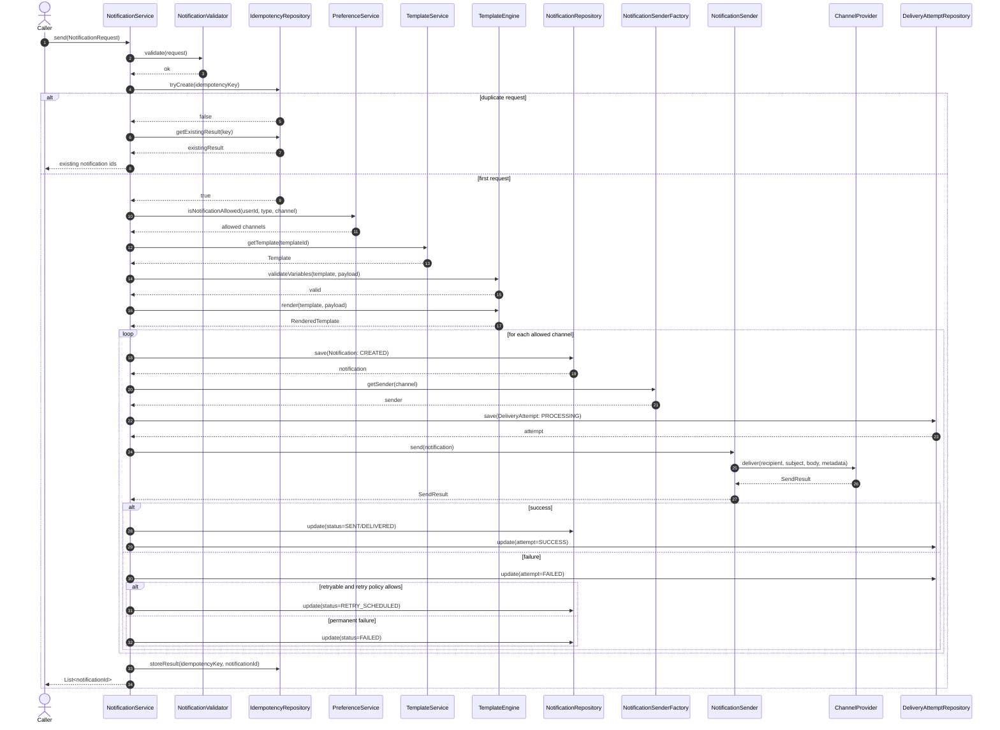

# Notification Service - Send Flow (GitHub Renderable Sequence)

This Mermaid sequence diagram renders directly on GitHub web.

```mermaid
sequenceDiagram
    autonumber
    actor Caller
    participant NS as NotificationService
    participant NV as NotificationValidator
    participant IR as IdempotencyRepository
    participant PS as PreferenceService
    participant TS as TemplateService
    participant TE as TemplateEngine
    participant NR as NotificationRepository
    participant NSF as NotificationSenderFactory
    participant SND as NotificationSender
    participant CP as ChannelProvider
    participant DAR as DeliveryAttemptRepository

    Caller->>NS: send(NotificationRequest)
    NS->>NV: validate(request)
    NV-->>NS: ok

    NS->>IR: tryCreate(idempotencyKey)
    alt duplicate request
        IR-->>NS: false
        NS->>IR: getExistingResult(key)
        IR-->>NS: existingResult
        NS-->>Caller: existing notification ids
    else first request
        IR-->>NS: true

        NS->>PS: isNotificationAllowed(userId, type, channel)
        PS-->>NS: allowed channels

        NS->>TS: getTemplate(templateId)
        TS-->>NS: Template

        NS->>TE: validateVariables(template, payload)
        TE-->>NS: valid
        NS->>TE: render(template, payload)
        TE-->>NS: RenderedTemplate

        loop for each allowed channel
            NS->>NR: save(Notification: CREATED)
            NR-->>NS: notification

            NS->>NSF: getSender(channel)
            NSF-->>NS: sender

            NS->>DAR: save(DeliveryAttempt: PROCESSING)
            DAR-->>NS: attempt

            NS->>SND: send(notification)
            SND->>CP: deliver(recipient, subject, body, metadata)
            CP-->>SND: SendResult
            SND-->>NS: SendResult

            alt success
                NS->>NR: update(status=SENT/DELIVERED)
                NS->>DAR: update(attempt=SUCCESS)
            else failure
                NS->>DAR: update(attempt=FAILED)
                alt retryable and retry policy allows
                    NS->>NR: update(status=RETRY_SCHEDULED)
                else permanent failure
                    NS->>NR: update(status=FAILED)
                end
            end
        end

        NS->>IR: storeResult(idempotencyKey, notificationId)
        NS-->>Caller: List<notificationId>
    end
```

